# 01_prompt - Prompt Engineering Fundamentals

Learn the fundamentals of how LLMs work and how to write effective prompts that produce reliable, consistent results.

## Learning Objectives

After completing this module, you will be able to:
- Understand how LLMs process requests and generate responses
- Recognize the statistical nature and limitations of LLMs
- Write clear, specific prompts that produce predictable results
- Use imperative vs declarative prompting appropriately
- Avoid common prompt engineering mistakes

## Prerequisites

- Basic understanding of what LLMs are
- Familiarity with text-based interfaces

## 📚 Module Content

### How LLMs Work

#### Architecture: From Client to Backend


#### What is a Prompt?

A **prompt** is your input message that instructs the LLM what to do. It can be:
- A simple question: "What is recursion?"
- A complex instruction: "Refactor this Python code to use async/await patterns"
- A multi-part request with examples and constraints

#### Key principle
Prompts should be specific, actionable, and include success criteria.

---

### Understanding LLM Limitations

#### Core Limitations

LLMs are **statistical pattern matchers**, not reasoning entities. They:

1. **Cannot fantasize or imagine**: They have no real-world experience, only patterns from training data
2. **Rely on word co-occurrence statistics**: "What sequence of tokens is most likely to follow these tokens?"
3. **Have no internal fact-checker**: Truth is incidental to statistical likelihood
4. **Cannot prioritize context like humans**: They use architectural hacks instead:
   - **Position bias**: Earlier content in context window is weighted more heavily
   - **Formatting bias**: Text in **BOLD**, CAPS, or with special markers gets higher attention scores
   - **Recency bias**: Recent messages have more weight (except in very long contexts)
   - **Attention mechanism limitations**: Information can be "lost" in the middle of very long contexts

```mermaid
flowchart TD
    A["POST /v1/messages<br/>Request to LLM"] --> B["System Prompt<br/>⭐⭐⭐ HIGHEST PRIORITY<br/>Fixed instructions about role"]

    B --> C["Messages Array<br/>⭐⭐ MEDIUM-HIGH PRIORITY"]

    C --> D["Recent Messages<br/>⭐⭐⭐ Higher Weight<br/>Last 5-10 exchanges"]
    C --> E["Older Messages<br/>⭐ Lower Weight<br/>May be summarized"]

    D --> F["Single Message Content<br/>Within each message:"]
    E --> F

    F --> G["Top of Message<br/>⭐⭐⭐ HIGHEST ATTENTION<br/>First sentences/paragraphs"]
    F --> H["Middle of Message<br/>⭐⭐ MEDIUM ATTENTION<br/>Can be 'lost' in long contexts"]
    F --> I["Bottom of Message<br/>⭐ LOWER ATTENTION<br/>May be deprioritized"]

    style A fill:#e1f5ff
    style B fill:#ff9999
    style C fill:#fff4e1
    style D fill:#ffcc99
    style E fill:#e8e8e8
    style G fill:#99ff99
    style H fill:#ffff99
    style I fill:#ffcccc
```



Think of LLM as a powerful auto-complete that breaks your sentences into pieces not based on human-meaning, but on statistics and priorities, then tries to "fill in" the gaps with "text in another language."

#### Hallucinations Are Inevitable

Recent research ([Xu et al., 2024](https://arxiv.org/abs/2401.11817)) proves mathematically that hallucinations cannot be eliminated because:

- **Gödel's Incompleteness applies**: LLMs cannot learn all computable functions
- **Training data limitations**: Always incomplete, contains contradictions and errors
- **Statistical prediction ≠ factual truth**: Most likely next token ≠ correct answer
- **RLHF training**: Models trained to prefer confident answers over "I don't know" (penalized for uncertainty)
- **No halting problem solution**: LLMs cannot predict when they'll generate incorrect information

**From research** ([Huang et al., 2023](https://arxiv.org/abs/2311.05232)):
- Hallucination rates vary from 1.5% to 83% depending on domain and model
- Medical/legal domains show higher hallucination rates due to specialized terminology
- Retrieval-Augmented Generation (RAG) reduces but doesn't eliminate hallucinations

---

### How Humans Should Delegate Tasks

**RULE**: LLMs need detailed instructions. What you don't write won't be done.

Think of the LLM like **Mister Meeseeks** from Rick and Morty: it will try to solve your task in the shortest, most literal way possible. It does **not** "fill in the gaps" with intuition.

**Mental model**: LLM = Function executor, not creative collaborator.

---

## 🎯 Prompt Engineering Best Practices

### Examples: Bad vs Good Prompts

These examples show common mistakes where humans **omit critical information** they assume the agent knows.

#### ❌ BAD PROMPT #1: Missing Context About Project Structure

```text
BAD: "The login isn't working, please fix it"
```

#### What human knows but didn't share:
- Which login? (Admin login? User login? OAuth login?)
- What error message appears?
- Which file contains the login code?
- What does "not working" mean (crash? wrong redirect? blank page?)
- What framework/language (React? Vue? Plain JS?)

#### Why bad:
- Agent has to guess which of 5 possible login implementations
- No error message = agent can't diagnose root cause
- No file path = agent will search entire codebase (slow, expensive)
- "Not working" could mean 100 different things
- **Result**: Agent makes assumptions, fixes wrong thing, wastes time

---

#### ✅ GOOD PROMPT #1: All Context Provided

```text
GOOD: "Fix the authentication error in src/components/LoginForm.tsx.

Error: 'Cannot read property userId of undefined' at line 47
Happens when: User enters correct credentials and clicks Login
Expected: Redirect to /dashboard with user session
Current: Page refreshes, stays on /login, console shows error

Context:
- Using React 18.2 with TypeScript
- Auth API endpoint: POST /api/auth/login
- Should receive response: {success: true, userId: string, token: string}
- Line 47 tries to access: response.data.userId

Do not modify:
- The API endpoint (/api/auth/login) - backend team owns this
- The redirect logic after successful login
- The form validation (already working)"
```

#### Why good:
- Exact file path provided (src/components/LoginForm.tsx)
- Exact error message with line number
- Reproduction steps clear
- Expected vs actual behavior specified
- Technical context given (React, TypeScript, API structure)
- Constraints specified (what NOT to change)

---

#### ❌ BAD PROMPT #2: Vague Requirements

```
BAD: "Add validation to the form"
```

#### What human knows but didn't share:
- Which form? (Contact form? Signup form? Payment form?)
- What fields need validation?
- What validation rules? (Required? Email format? Length limits?)
- Where to display errors? (Inline? Top of form? Toast?)
- When to validate? (On submit? On blur? On change?)

#### Why bad:
- Agent doesn't know which form (could be 10+ forms in project)
- No validation requirements = agent will guess (probably wrong)
- No UX requirements = might create inconsistent experience
- **Result**: Agent adds generic validation that doesn't match your needs

---

#### ✅ GOOD PROMPT #2: Specific Requirements

```
GOOD: "Add validation to the user registration form in src/pages/Register.tsx.

Fields to validate:
1. Email (line 34):
   - Required
   - Must match pattern: /^[^\s@]+@[^\s@]+\.[^\s@]+$/
   - Show error: 'Please enter a valid email address'

2. Password (line 42):
   - Required
   - Minimum 8 characters
   - Must contain: 1 uppercase, 1 lowercase, 1 number
   - Show error: 'Password must be at least 8 characters with uppercase, lowercase, and number'

3. Confirm Password (line 50):
   - Must match Password field
   - Show error: 'Passwords do not match'

Validation behavior:
- Validate each field onBlur (when user leaves field)
- Re-validate on change after first error shown
- Show errors inline below each field (red text, 12px)
- Disable Submit button if any errors exist
- Use existing ErrorText component from src/components/common/ErrorText.tsx

Do not modify:
- The form layout or styling
- The submit handler (handleSubmit function)
- Any other form fields"
```

#### Why good:
- Specific file and line numbers
- Exact validation rules for each field
- Exact error messages to display
- Clear UX behavior (when to validate, where to show errors)
- References existing component to maintain consistency
- Clear constraints on what NOT to change

---

#### ❌ BAD PROMPT #3: Missing Error Context

```
BAD: "The API call is failing, help me debug it"
```

#### What human knows but didn't share:
- Which API call? (Could be 50+ API calls in codebase)
- What error code/message?
- What's the request payload?
- What's the expected response?
- When does it fail? (Always? Sometimes? Specific conditions?)

#### Why bad:
- Agent can't locate the failing API call
- No error details = can't diagnose
- Might be network issue, auth issue, data issue, code issue - agent has no clues
- **Result**: Agent asks 5 follow-up questions, wastes 10 minutes

---

#### ✅ GOOD PROMPT #3: Complete Debugging Context

```
GOOD: "Debug the failing API call in src/services/userService.ts, function updateUserProfile (line 67).

Error details:
- Status: 400 Bad Request
- Response body: {error: 'Invalid date format', field: 'birthDate'}
- Network tab shows request payload:
  {
    userId: '12345',
    name: 'John Doe',
    birthDate: '1990-05-15'  <-- This field is the problem
  }

Expected payload format (from API docs):
- birthDate should be ISO 8601: '1990-05-15T00:00:00.000Z'

Current code (line 67):
const payload = {
  userId: user.id,
  name: user.name,
  birthDate: user.birthDate  // Coming from date picker as 'YYYY-MM-DD'
};

Fix needed:
- Convert birthDate from 'YYYY-MM-DD' format to ISO 8601 before sending
- Add validation: ensure birthDate is not in the future
- Add error handling: if date conversion fails, show user-friendly message

Test cases:
1. Valid date '1990-05-15' → should convert to '1990-05-15T00:00:00.000Z'
2. Invalid date 'abc' → should show error: 'Invalid date format'
3. Future date '2030-01-01' → should show error: 'Birth date cannot be in the future'"
```

#### Why good:
- Exact file, function, and line number
- Complete error details (status, response body)
- Shows actual vs expected data format
- Includes current code causing the problem
- Specifies exact fix needed
- Includes test cases to verify fix

---

### Key Patterns in Good Prompts

#### Always include:
1. **Exact file paths** - src/components/LoginForm.tsx (not "the login file")
2. **Line numbers** - Line 47 (when relevant)
3. **Error messages** - Full error text, not "it errors"
4. **Expected vs Actual** - What should happen vs what happens
5. **Context** - Framework, language, dependencies
6. **Constraints** - What NOT to change
7. **Success criteria** - How to verify it works

#### Never assume the agent knows:
- Your project structure
- Which file you're talking about
- What "better", "fix", "improve" means
- What error you're seeing
- What behavior you expect
- What you've already tried

---

### Declarative vs Imperative Instructions

> **⚠️ CRITICAL RECOMMENDATION FOR BEGINNERS:**
>
> **Start with imperative instructions for your first month.**
>
> Declarative prompts feel "lighter" and "faster" - you just describe what you want and the agent figures out how. This feels more natural and less tedious than spelling out every step.
>
> **This is an illusion. Declarative is actually HARDER.**
>
> Why? Because when declarative prompts fail, you can't debug them. One doesn't know which step the agent got wrong. You don't know what assumptions it made. You just know the result is wrong.
>
> With imperative instructions, you:
> 1. **Learn LLM limitations** by hitting them explicitly
> 2. **Understand where agents fail** (ambiguity, assumptions, context)
> 3. **Build intuition** for what needs to be specified
> 4. **Can debug** by seeing exactly which step went wrong
> 5. **Develop the "muscle"** for detailed thinking
>
> **The hard way IS the fast way.** After 1-2 months of imperative prompts, you'll have trained yourself to think precisely. Only THEN will declarative prompts work reliably, because you'll naturally include all the details needed.
>
> **Timeline:**
> - **Month 1**: Pure imperative - "Do step 1, then step 2, then step 3"
> - **Month 2**: Mostly imperative with some declarative experiments
> - **Month 3+**: Can use declarative effectively because you know what details matter

---

**Imperative** (Do A, then B, then C):
```
1. Read the file src/utils/helpers.js
2. Find all TODO comments
3. For each TODO, create a GitHub issue with label "todo"
4. Add the issue number as a comment next to the TODO
5. Commit changes with message "Link TODOs to issues"
```
#### Characteristics:
- ✅ Easy to debug (you know which step failed)
- ✅ Forces you to think through the process
- ✅ Makes you aware of LLM limitations
- ✅ Works reliably even with less experienced prompting
- ❌ Feels tedious (but this is valuable training!)
- ❌ Longer prompts (but clearer results)

#### Best for:
- **Beginners** (first 1-2 months)
- **Complex tasks** where order matters
- **Critical tasks** where mistakes are expensive
- **Debugging** failed attempts

---

**Declarative** (Describe desired outcome):
```
"Transform all TODO comments in the codebase into GitHub issues with
appropriate labels (frontend/backend/bug/feature) based on the file location
and comment content. Link each TODO to its issue number. The commit message
should describe the total number of issues created."
```
#### Characteristics:
- ✅ Shorter, feels more natural
- ✅ Gives agent flexibility in approach
- ✅ Works well once you've trained your instincts
- ❌ Hard to debug when it fails
- ❌ Requires you to implicitly know what details to include
- ❌ Agent makes assumptions you might not want
- ❌ **Only works reliably after months of practice**

#### Best for:
- **Experienced users** (3+ months)
- **Simple, well-defined tasks**
- **When you truly don't care about implementation details**

---

## 🛠️ Practical Exercise

Try converting this bad prompt into a good one:

**Bad**: "Make the app faster"

Think about:
- What specific performance issues?
- Which parts of the app?
- What does "faster" mean (load time? response time? render time?)
- Which are the current metrics?
- Which are the target metrics?
- What constraints exist?

---

## 📊 Key Takeaways

1. **LLMs are statistical tools**, not reasoning entities
2. **Specific prompts** yield better results than vague ones
3. **Start with imperative prompts** for the first 1-2 months
4. **Include all context** - don't assume the agent knows anything
5. **Practice makes perfect** - the more you prompt, the better you'll become

## 🔗 Next Steps

After mastering prompt engineering fundamentals:
- **Continue to** [02_context](02_context.md) - Learn about context management and optimization
- **Practice writing prompts** using the examples above
- **Start with small tasks** and gradually increase complexity
- **Review the [Contributing Guidelines](../CONTRIBUTING.md)** if you want to help improve this content

---

*This module provides the foundation for all subsequent modules. Master these concepts before proceeding to more advanced topics.*