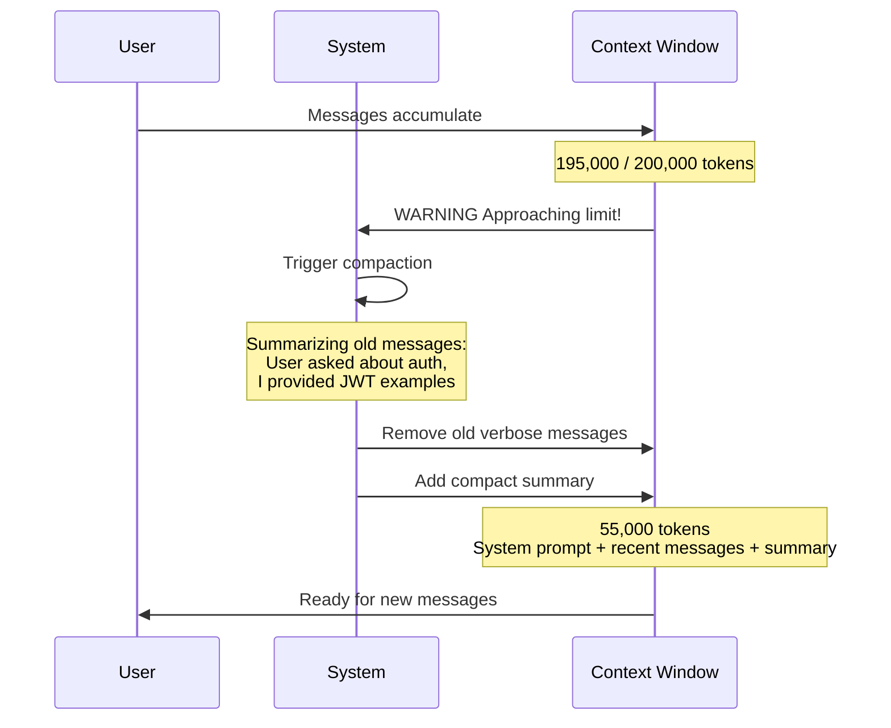
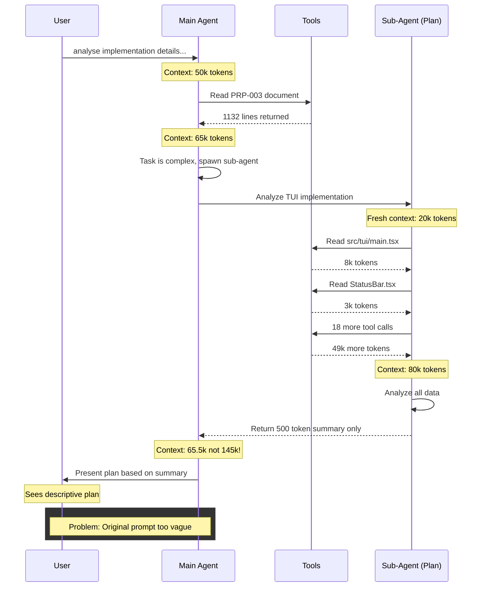
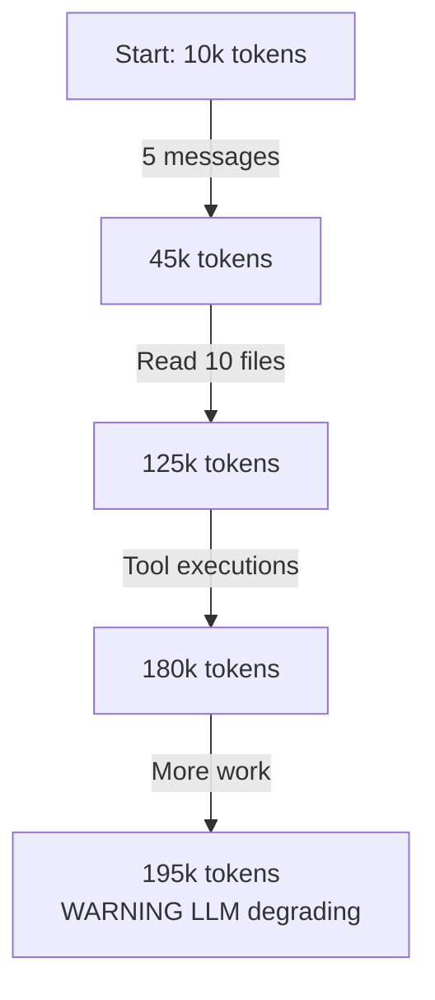

# Context Management

Master context window management, token economics, and optimization strategies for working efficiently with LLMs, with specific focus on Claude API and implementation details.

## Learning Objectives

After completing this module, you will be able to:
- Understand how context windows work and their limitations
- Optimize token usage for cost and performance
- Manage context effectively in long conversations
- Implement context compression and summarization strategies
- Monitor and control context pollution
- Understand Claude API-specific implementation details

## Prerequisites

- Completion of [01_prompt](01_prompt.md)
- Basic understanding of LLM APIs

## Course Module Content

### Understanding Context Windows

#### What is Context?

**Context** is everything the LLM "sees" when generating a response:

1. **System Prompt**: Core instructions about the LLM's role and capabilities (typically 30-70k tokens)
2. **Your Messages**: All messages you've sent in the conversation
3. **LLM Responses**: All previous responses from the LLM
4. **Hidden Summaries**: Compacted versions of old exchanges to save space
5. **Tool Results**: Output from tools the agent has used (file reads, bash commands, web searches)
6. **Memory/Project Files**: Project-specific instructions if configured

#### Context Overflow Management



---

### Token Economics

#### Token Calculation Basics

**1 token ≈ 4 characters** (for English text, approximate)

```md
English:  ~4 characters = 1 token
          1000 characters ≈ 250 tokens

Russian:  ~2.5 characters = 1 token
          1000 characters ≈ 400 tokens (60% more expensive!)

Chinese:  ~1.5 characters = 1 token
          1000 characters ≈ 650 tokens (160% more expensive!)

Code:     ~3.5 characters = 1 token (more efficient due to symbols)
          1000 characters ≈ 285 tokens
```

#### Context Window Sizes (December 2024) *(✓ Pricing verified December 2025)*

| Model                          | Context Window | Input Cost       | Output Cost      |
|--------------------------------|----------------|------------------|------------------|
| Claude Opus 4                  | 200,000        | $15/1M tokens    | $75/1M tokens    |
| Claude Sonnet 4.5              | 200,000        | $3/1M tokens     | $15/1M tokens    |
| Claude Haiku 4                 | 200,000        | $0.80/1M tokens  | $4/1M tokens     |
| GPT-4 Turbo                    | 128,000        | $10/1M tokens    | $30/1M tokens    |
| GPT-4o                         | 128,000        | $2.50/1M tokens  | $10/1M tokens    |
| Gemini 1.5 Pro                 | 2,000,000      | $1.25/1M tokens  | $5/1M tokens     |
| Gemini 1.5 Flash               | 1,000,000      | $0.075/1M tokens | $0.30/1M tokens  |

---

### Claude Code Request-Response Flow

#### Visual Overview


#### Real Example Breakdown

Let's trace through an actual Claude Code interaction:

#### USER Request
```bash
> analyse implementation details in our code according to
  prp/PRPs/PRP-003-tui-implementation.md
```

#### Step 1: Initial Response + Hidden Command

#### What you see:
```md
> I'll analyze the implementation details for PRP-003 TUI implementation.
  Let me first read the PRP document and then examine the current codebase
  to understand what has been implemented.
```

#### What happens in context:
- Agent decides it needs to read the file first
- Generates hidden tool call: `Read(PRPs/PRP-003-tui-implementation.md)`

#### Context at this point:
```md
[System Prompt: ~50k tokens]
[User Message: "analyse implementation..." ~15 tokens]
[Assistant Thinking: "I need to read PRP first..." ~50 tokens]
[Tool Call: Read(...) - waiting for result]
Total: ~50,065 tokens
```

#### Step 2: Tool Execution

#### What you see:
```md
> Read(PRPs/PRP-003-tui-implementation.md)
  ⎿  Read 1132 lines
```

#### What happens:
- File content loaded into context (full 1132 lines)
- Context size increases significantly
- Claude now has the full requirements document

#### Context now:
```
[System Prompt: ~50k tokens]
[User Message: ~15 tokens]
[Assistant Thinking: ~50 tokens]
[Tool Result: File contents - ~15k tokens]
Total: ~65,065 tokens
```

**Why this matters**: Every tool result stays in context until:
1. You manually clear with `/clear`
2. Automatic compaction triggers near limit
3. Session ends

#### Step 3: Agent Decides to Use Sub-Agent

#### What you see:
```md
> Now I'll use the Task tool with a Plan subagent to analyze the TUI
  implementation details comprehensively.
```

#### What happens:
- Main agent realizes task is complex (needs to read many files)
- Decides to spawn a **sub-agent with independent context**
- Sub-agent gets its own fresh context window (doesn't inherit main agent's 65k tokens)

**Why sub-agents?**
1. **Context isolation**: Sub-agent doesn't pollute main conversation
2. **Specialized instructions**: Sub-agent can have different system prompt (e.g., "You are a code analysis expert")
3. **Parallel work**: Multiple sub-agents can work simultaneously
4. **Cost efficiency**: Main agent doesn't pay token cost for sub-agent's exploration

#### Step 4: Sub-Agent Execution

#### What you see:
```md
> Plan(Analyze TUI implementation progress)
  ⎿  Done (20 tool uses • 80.1k tokens • 1m 4s)
```

#### What happens in sub-agent context:

#### Sub-agent receives:
```
[Sub-agent System Prompt: "You are a code analysis expert..." ~5k tokens]
[Task: "Analyze TUI implementation against PRP-003" ~100 tokens]
[PRP Document: ~15k tokens]
[Access to tools: Read, Bash, Search codebase]
Total start: ~20,100 tokens
```

#### Sub-agent executes 20 tool calls:
1. `Read(src/tui/main.tsx)` - loads main TUI file (~8k tokens)
2. `Read(src/tui/components/StatusBar.tsx)` - checks status bar (~3k tokens)
3. `Read(src/tui/components/PRPList.tsx)` - checks PRP list (~4k tokens)
4. `Bash(grep -r "EventBus" src/)` - searches for event integration (~2k tokens)
5. `Read(src/tui/hooks/useKeyboard.tsx)` - keyboard hooks (~3k tokens)
6-20. ... More file reads and searches (~30k tokens)

**Sub-agent context grows to 80,100 tokens** with all the code it read.

#### Sub-agent performs analysis and generates SHORT SUMMARY:
```json
{
  "status": "65% complete",
  "implemented": [
    "Basic TUI layout with StatusBar and PRPList components",
    "Static rendering of PRP information",
    "Component structure following requirements"
  ],
  "partially_implemented": [
    "Keyboard navigation (Tab works, S/X shortcuts missing)",
    "Debug mode (screen exists but no live data)"
  ],
  "missing_features": [
    "Real-time EventBus integration",
    "Melody.json file generation for music sync",
    "Complete keyboard navigation (S/X actions)",
    "Live agent status updates"
  ],
  "implementation_quality": "excellent",
  "critical_blockers": 2,
  "estimated_completion": "3-4 days"
}
```

**IMPORTANT**: Only this ~500 token summary (not full 80k context) returns to main agent!

**Token savings**:
- Without sub-agent: Main context would be 50k + 15 + 15k + 80k = **145,015 tokens**
- With sub-agent: Main context stays at 50k + 15 + 15k + 500 = **65,515 tokens**
- **Savings: 79,500 tokens (~55% reduction)**

---

### Context Pollution Control

#### The Problem



#### Solutions

#### Frequent clearing:
```bash
Task: "Implement authentication"
→ Work on it (multiple prompts, file reads)
→ Task complete ✓
→ /clear immediately (critical!)

Next task: "Add logging"
→ Fresh context, no pollution from auth work
→ Clean slate, optimal performance
```

#### Use sub-agents for isolation:
```bash
> Use code-analyzer sub-agent to find performance issues in src/,
  then use optimizer sub-agent to fix them.

# Sub-agents work in parallel, isolated contexts
# Main conversation stays clean
# Only summaries return to main context
```

### Optimization Strategies

#### 1. Prompt Compression

[FAIL] Wasteful (127 tokens):
```
I would like you to please analyze the implementation details of our
codebase specifically looking at the terminal user interface components
and comparing them against the requirements document that I have which
is located at the path prp/PRPs/PRP-003-tui-implementation.md and then
provide me with a comprehensive breakdown of what has been completed
versus what still needs to be done and also identify any potential
issues or blockers that might prevent us from finishing this work.
```

[PASS] Efficient (31 tokens):
```
Analyze TUI implementation against prp/PRPs/PRP-003-tui-implementation.md.
Return: completion status, missing features, blockers.
Format: markdown table.
```

**Savings: 96 tokens (~76% reduction)**

#### 2. Avoid Repeated File Reads

[FAIL] Bad (16k tokens wasted):
```
Message 1: "Analyze auth.ts"
→ Agent reads auth.ts (8k tokens added to context)

Message 2: "Now check if it handles errors properly"
→ Agent reads auth.ts AGAIN (now 16k tokens total!)

Message 3: "What about the types?"
→ Agent reads auth.ts THIRD TIME (24k tokens!)
```

[PASS] Good (12k tokens total):
```
"Analyze auth.ts and auth-types.ts together. Check:
1. Logic correctness
2. Error handling completeness
3. Type safety
Return findings as numbered list."

→ Agent reads both files once (12k tokens)
→ All analysis done in single pass
→ 50% token savings
```

#### 3. Use Artifacts for Large Outputs

When asking for large code generation:
```
> Generate a complete REST API with CRUD operations for User, Post, Comment models.
  Include TypeScript types, validation, error handling, tests.

Claude creates artifact (separate context)
→ Your conversation context stays small (~1k tokens for request)
→ Artifact can be 50k+ tokens without polluting main context
→ Can regenerate artifact without affecting conversation
→ Can have multiple artifacts in same conversation
```

---

## Practice Troubleshooting Common Issues

### Issue: "Claude keeps forgetting what we discussed"

#### Symptoms:
- Agent asks for information you already provided
- Agent repeats previous suggestions
- Agent doesn't remember earlier decisions

**Cause**: Context overflow - old messages compacted/removed

**Solutions**:
1. Check context size with `Ctrl+O`
   - If > 150k tokens, use `/compact` or `/clear`
2. Use `/clear` more frequently (after each major task)
3. Break large tasks into smaller ones (each fits in one context)
4. Use sub-agents for isolated work (analysis, exploration)
5. Put critical information in CLAUDE.md file (always included)
6. Re-state critical constraints at start of each prompt

#### Prevention:
```bash
# Add to CLAUDE.md in project root:
## Critical Context (Always Remember)
- Authentication uses JWT tokens (not sessions)
- Database is PostgreSQL 14
- Use TypeScript strict mode
- All dates in ISO 8601 format
- Test coverage minimum: 80%
```

---

### Issue: "Agent is doing things I didn't ask for"

#### Symptoms:
- Agent modifies files you didn't mention
- Agent changes code style unexpectedly
- Agent adds features you didn't request

**Cause**: Vague prompt, agent filling in gaps with assumptions

**Solutions**:
1. Be MORE specific in prompts
   - List exact files to modify
   - Specify what NOT to change
   - Define success criteria clearly

2. Use imperative instructions:
   ```
   [FAIL] "Improve the authentication code"
   [PASS] "In src/auth/login.ts, add email validation before password check.
      Do not modify password hashing logic.
      Do not change error message formats."
   ```

3. Add explicit constraints:
   ```
   "Constraints:
   - Modify ONLY src/auth/login.ts
   - Do not change function signatures
   - Do not add new dependencies
   - Do not modify test files"
   ```

4. Use Plan mode to review before execution:
   ```bash
   Shift+Tab  # Enter plan mode
   # Review plan
   # If plan includes unexpected changes, refine prompt
   ```

---

### Issue: "Agent gives wrong/outdated information"

#### Symptoms:
- Agent suggests deprecated APIs
- Agent references non-existent libraries
- Agent provides incorrect factual information

**Cause**: Hallucination (statistical prediction, not facts)

**Solutions**:
1. Ask agent to search documentation:
   ```
   [FAIL] "How do I use the Anthropic API?"
   [PASS] "Search the official Anthropic documentation for API authentication.
      Provide the current recommended approach."
   ```

2. Provide reference material in context:
   ```
   "Using the authentication approach described in docs/api/auth.md,
   implement JWT token validation."
   ```

3. Use RAG (Retrieval Augmented Generation) tools:
   - MCP servers for documentation
   - Vector databases for codebase search
   - Official docs as context

4. Verify critical information independently:
   - Check official docs manually
   - Test the generated code
   - Review diffs before committing

5. Request citations:
   ```
   "Explain JWT token expiration handling.
   Cite specific sections from RFC 7519 if possible."
   ```

---

### Issue: "Token costs are higher than expected"

#### Symptoms:
- Bills higher than estimated
- Individual requests expensive
- Context growing unexpectedly

**Causes**:
1. Context bloat (repeated file reads)
2. Using non-English text (2x tokens for Russian, 2.6x for Chinese)
3. Large outputs
4. Not using prompt caching
5. Wrong model selection (using Opus when Sonnet would suffice)

**Solutions**:
1. Clear context frequently:
   ```bash
   /clear     # After each major task
   Ctrl+O     # Monitor context size
   ```

2. Write prompts in English:
   ```
   [FAIL] Russian: 1000 chars = ~400 tokens = $0.0012 input (Sonnet)
   [PASS] English: 1000 chars = ~250 tokens = $0.00075 input (Sonnet)
   Savings: 37.5% per request
   ```

3. Request concise outputs:
   ```
   "Summarize in <200 words"
   "Return only the function signature, not full implementation"
   "List the top 5 issues, not all 47"
   ```

4. Use sub-agents to isolate large analyses:
   ```
   "Use sub-agent to analyze all 50 files, return only:
   - Total lines of code
   - Average complexity score
   - Top 3 refactoring priorities"

   → Sub-agent reads 200k tokens
   → Main agent receives 100 token summary
   → 99.95% context savings
   ```

5. Choose right model:
   ```
   Simple tasks (linting, formatting): Haiku ($0.80/1M in)
   Code generation: Sonnet ($3/1M in)
   Complex architecture: Opus ($15/1M in)

   Example:
   Fix 100 linting errors:
   Haiku: $0.08
   Sonnet: $0.30 (4x more expensive!)
   Opus: $1.50 (19x more expensive!)
   ```

6. Enable prompt caching:
   - Use stable system prompts
   - Group related tasks
   - Cache saves 90% on repeated content

---

### Issue: "Agent is too slow"

#### Symptoms:
- Responses taking 30+ seconds
- Multiple retries before success
- Timeouts on large tasks

**Causes**:
1. Context exceeding 150k tokens
2. Complex tool chains (10+ tool calls)
3. Sub-agent spawning overhead
4. Large file reads (100k+ tokens)
5. Model choice (Opus slower than Sonnet)

**Solutions**:
1. Reduce context size:
   - `/clear` before starting
   - Remove large tool results
   - Use `/compact` instead of keeping full history

2. Optimize tool usage:
   - Batch file reads: "Read files A, B, C" (not separate requests)
   - Use grep/search instead of reading full files
   - Request specific functions, not entire files

3. Use faster model for simple tasks:
   ```
   Haiku: 2-3 seconds average
   Sonnet: 4-6 seconds average
   Opus: 8-12 seconds average
   ```

4. Parallelize with sub-agents:
   ```
   [FAIL] Serial (slow):
   Read file → Analyze → Fix → Test → Commit
   Total: 60 seconds

   [PASS] Parallel (fast):
   Sub-agent 1: Analyze frontend files
   Sub-agent 2: Analyze backend files
   Sub-agent 3: Analyze database files
   Main agent: Merge results
   Total: 25 seconds
   ```

5. Use headless mode for batch processing:
   ```bash
   # Process 100 files
   [FAIL] Interactive: 100 × 10s = 1000s (17 minutes)
   [PASS] Headless batch: 100 files in 300s (5 minutes)

   claude -p "Fix linting errors in src/**/*.ts" --dangerously-skip-permissions
   ```

---

## Practice Practical Examples

### Context Hygiene Checklist

Before long task:
☐ Check current context size (Ctrl+O)
☐ Clear if > 100k tokens
☐ Consider using sub-agent if task needs many file reads

During task:
☐ Monitor context growth
☐ Use /compact if approaching 150k
☐ Avoid re-reading same files

After task:
☐ /clear immediately
☐ Don't carry context to next task
☐ Start fresh

### Cost Calculation Example

#### Simple Q&A Session (Claude Sonnet 4.5)

```
Scenario: 10 back-and-forth exchanges

User inputs: 10 messages × 50 tokens each = 500 tokens
Claude responses: 10 messages × 150 tokens each = 1,500 tokens
System prompt: 50,000 tokens (included in every request)

Total input tokens per message: 50,000 + cumulative conversation
- Message 1: 50,000 + 50 = 50,050 input tokens
- Message 2: 50,000 + 50 + 150 + 50 = 50,250 input tokens
- Message 3: 50,000 + 400 + 50 = 50,450 input tokens
- ...
- Message 10: 50,000 + 1,650 + 50 = 51,700 input tokens

Total input tokens: 50,050 + 50,250 + ... ≈ 505,000 tokens
Total output tokens: 1,500 tokens

Cost = (505,000 × $3/1M) + (1,500 × $15/1M)
     = $1.515 + $0.0225
     = $1.54 for the 10-message conversation

With prompt caching (90% discount on system prompt):
Cached: 50,000 tokens × 0.9 = 45,000 tokens saved per message
Savings: 45,000 × 9 messages × $3/1M = $1.215
New cost: $1.54 - $1.215 = $0.325
```

## Summary Key Takeaways

1. **Context management is critical** for quality and cost
2. **Clear context after each task** using `/clear`
3. **Use sub-agents for exploration** that requires reading many files
4. **Monitor context size** with `Ctrl+O` in Claude Code
5. **Optimize prompts** to reduce token usage
6. **English text** is ~40-60% cheaper than Russian/Chinese
7. **Claude Code API** provides specific tools for context management
8. **Troubleshoot systematically** using the patterns above

## 🔗 Next Steps

After mastering context management:
- **Continue to** [03_claudecode](03_claudecode.md) - Learn about Claude Code CLI and practice with specs
- **Practice context optimization** techniques in your own projects
- **Review the [Contributing Guidelines](../CONTRIBUTING.md)** if you want to help improve this content

---

*This module combines practical context management techniques with Claude API-specific implementation details. For more comprehensive information, see the original guide.*