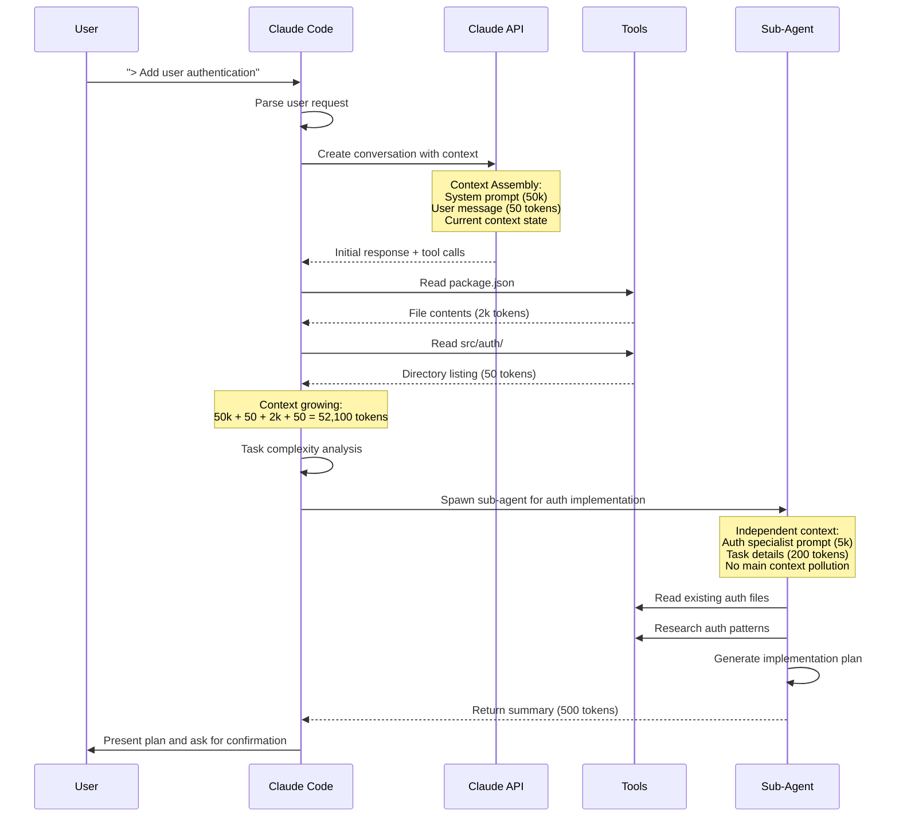

# Claude Code CLI & Sub-agents

Practical guide to using Claude Code CLI, sub-agent orchestration, and advanced workflows with hands-on examples and detailed breakdown of execution flow.

## Learning Objectives

After completing this module, you will be able to:
- Install and configure Claude Code CLI
- Use sub-agents for complex task decomposition
- Implement advanced workflow patterns
- Debug and optimize agent-based systems
- Practice with real-world development scenarios
- Create detailed implementation specifications

## Prerequisites

- Completion of [02_context](02_context.md)
- Access to Claude API
- Command-line interface familiarity

## Course Module Content

### Getting Started with Claude Code

#### Step 1: Initial Setup

```bash
# Install Claude Code CLI
npm install -g @anthropic-ai/claude-code

# Run Claude Code to start the wizard
claude
```

The wizard will guide you through:
1. **Authentication setup** - Create API key
2. **Project initialization** - Set up your development environment
3. **Configuration** - Choose model preferences

#### Step 2: Choose Your Plan

**Option A: Official Anthropic Plan**
- Direct integration with Claude API
- Full feature support
- Usage-based pricing

**Option B: Z.AI Alternative (Recommended 💰)**
- **Starting at just $3/month** *(✓ Verified December 2025)*
- Full support for Claude Code, Cline, and 10+ top coding tools
- Limited-time deal available

Quick **You've been invited to join the GLM Coding Plan!**

Subscribe now: [https://z.ai/subscribe?ic=AT4ZFNNRCJ](https://z.ai/subscribe?ic=AT4ZFNNRCJ)

#### Step 2B: Complete Setup with Z.AI

After subscribing to Z.AI:

1. **Create API Key** in your Z.AI dashboard
2. **Configure Claude Code** following: [https://docs.z.ai/devpack/tool/claude](https://docs.z.ai/devpack/tool/claude)

#### Step 3: Create Your First Project

```bash
# Create new project directory
mkdir my-project
cd my-project

# Initialize Claude Code
claude init

# Create specs directory for project specifications
mkdir -p specs

# Create initial project specification
# See specs/01-init.md below for detailed template
```

---

### Claude Code Execution Breakdown

#### Request-Response Flow Deep Dive

Let's examine the complete flow of a Claude Code interaction with detailed breakdown:



#### Step-by-Step Execution Analysis

**Initial Request Processing:**
```
USER: "> Add user authentication with JWT tokens"

CLAUDE CODE INTERNAL PROCESS:
1. Parse request type (feature addition)
2. Identify domain (authentication)
3. Estimate complexity (medium-high)
4. Check for existing patterns in codebase
5. Determine if sub-agent is needed
```

**Context Assembly:**
```
[SYSTEM PROMPT: Claude Code instructions (~50k tokens]
[CONVERSATION HISTORY: Previous messages (~5k tokens)]
[CURRENT REQUEST: "Add user authentication..." (~50 tokens)]
[WORKING DIRECTORY: /path/to/project]
[ENVIRONMENT: Node.js, TypeScript, Express detected]
```

**Tool Execution Phase:**
```
TOOL CALL 1: Read package.json
→ Dependencies: express, jsonwebtoken, bcryptjs already present
→ Project type: Node.js/TypeScript API

TOOL CALL 2: List src/ directory
→ Structure: src/controllers/, src/models/, src/middleware/
→ Existing auth directory: src/auth/

TOOL CALL 3: Read src/auth/ files
→ Existing: login.ts, register.ts (incomplete)
→ Status: Partial implementation exists
```

**Sub-Agent Decision:**
```
IF (task involves multiple files AND existing code found)
THEN spawn sub-agent for:
- Code analysis
- Architecture planning
- Step-by-step implementation
```

---

### Sub-Agent Orchestration

#### When to Use Sub-Agents

**Use sub-agents for:**
- **Code analysis** across multiple files
- **Architecture planning** for complex features
- **Research tasks** requiring documentation lookup
- **Parallel work** on independent components
- **Isolated exploration** to avoid context pollution

**Don't use sub-agents for:**
- **Simple, single-file changes**
- **Quick fixes** (bug patches, typo corrections)
- **Straightforward implementations** with clear requirements

#### Sub-Agent Types and Specializations

```bash
# 1. Code Review Agent
Plan("Review pull request #123 for code quality and best practices")

# 2. Architecture Agent
Task(architect, "Design microservices architecture for user management")

# 3. Testing Agent
Task(testing, "Create comprehensive test suite for authentication module")

# 4. Documentation Agent
Task(documentation, "Generate API documentation from OpenAPI spec")
```

#### Real Sub-Agent Example

**Request:** "Analyze the performance bottlenecks in our React application"

**Main Agent Process:**
```bash
> Task(performance-analyzer, "Find performance issues in src/components/")
> Done (45 tool uses • 125.3k tokens • 2m 15s)

Results:
- Large bundle size (2.3MB minified)
- Missing code splitting
- Unoptimized images in assets/
- Memory leaks in 3 components
- Inefficient re-renders in dashboard
```

**What actually happened in sub-agent:**
```
PERFORMANCE ANALYZER CONTEXT:
[Specialized prompt: "You are a React performance expert..." (3k tokens)]
[Task: "Find performance issues in src/components/" (80 tokens)]
[Tools: Bundle analyzer, React DevTools, Memory profiler]

EXECUTED TOOL CALLS:
1. Read webpack.config.js
2. Analyze bundle size with webpack-bundle-analyzer
3. Check src/components/ for large files (>5KB)
4. Search for useEffect without dependencies
5. Look for missing React.memo()
6. Check image optimization
7. Analyze import statements for tree-shaking
8. Profile memory usage patterns
9. Check for unnecessary re-renders
10-45. More detailed analysis...

OUTPUT: Structured report with specific issues and recommendations
```

---

### Practical Implementation Scenarios

#### Scenario 1: Adding a New API Endpoint

**Step 1: Analysis Phase**
```bash
> I need to add a DELETE /api/users/:id endpoint

# Claude Code automatically:
1. Checks existing user routes
2. Identifies patterns used
3. Finds related models and middleware
4. Looks for authentication requirements
```

**Step 2: Planning Phase**
```bash
> Task(api-designer, "Plan DELETE /api/users/:id endpoint following existing patterns")

# Sub-agent returns:
- Endpoint structure
- Required middleware
- Error handling patterns
- Database operations needed
- Response format
```

**Step 3: Implementation Phase**
```bash
> Now implement the endpoint following the plan:
1. Add route to src/routes/users.ts
2. Create controller method in src/controllers/userController.ts
3. Add validation middleware
4. Update API documentation
5. Add error handling for user not found
```

#### Scenario 2: Refactoring a Component

**Current Situation:** Large, monolithic React component (800+ lines)

**Step 1: Analysis**
```bash
> Analyze src/components/Dashboard.tsx for refactoring opportunities

# Claude Code identifies:
- Multiple responsibilities (data fetching, rendering, state management)
- Repeated UI patterns
- Large hook dependencies
- Potential for component splitting
```

**Step 2: Refactoring Plan**
```bash
> Task(refactor-planner, "Create refactoring plan for Dashboard.tsx")

# Sub-agent provides:
- Component breakdown structure
- Hook extraction plan
- State management improvements
- Testing strategy
```

**Step 3: Implementation**
```bash
> Execute refactoring:
1. Extract Header component (lines 1-150)
2. Extract Sidebar component (lines 151-300)
3. Extract useDashboardData hook (lines 301-500)
4. Extract Charts section (lines 501-800)
5. Update parent Dashboard component
6. Add tests for new components
```

#### Scenario 3: Debugging Complex Issue

**Problem:** Memory leak in React application

**Systematic Debugging Process:**
```bash
> Memory usage increases by 50MB after navigating between routes

# Step 1: Initial analysis
> Task(memory-analyzer, "Find memory leak sources")

# Sub-agent investigation:
- Checks useEffect cleanup
- Looks for event listeners not removed
- Searches for setInterval/setTimeout not cleared
- Analyzes component mounting/unmounting

# Step 2: Targeted investigation
> Focus on src/components/DataVisualizer.tsx (identified as leak source)

# Step 3: Fix implementation
> Add cleanup to DataVisualizer component:
- Clear chart instances on unmount
- Remove event listeners
- Cancel pending API calls
```

---

### Advanced Workflow Patterns

#### Pattern 1: Parallel Development

**Task:** Implement user profile and settings pages simultaneously

```bash
# Launch parallel sub-agents
> Task(frontend, "Implement user profile page UI")
> Task(backend, "Create user settings API endpoints")
> Task(database, "Add user preferences table schema")

# Main agent coordinates:
- Wait for all sub-agents to complete
- Review results together
- Create integration plan
- Test full workflow
```

#### Pattern 2: Progressive Enhancement

**Task:** Add real-time features to existing chat application

```bash
# Phase 1: Analysis
> Task(realtime-analyzer, "Assess current chat architecture for WebSocket integration")

# Phase 2: Implementation
> Based on analysis, implement in stages:
1. Add WebSocket server support
2. Update client for real-time messages
3. Add typing indicators
4. Implement online status
5. Add message read receipts

# Each phase gets its own context with clean slate
```

#### Pattern 3: Documentation-First Development

**Task:** Build new payment processing feature

```bash
# Step 1: Specification
> Task(spec-writer, "Create detailed payment processing specification")

# Step 2: Implementation
> Use specification as guide:
- Follow defined API contracts
- Implement described error cases
- Meet specified performance requirements
- Add required logging and monitoring

# Step 3: Validation
> Task(tester, "Validate implementation against specification")
```

---

### Debugging and Optimization

#### Common Issues and Solutions

**Issue 1: Claude Code "forgets" previous context**
```bash
# Problem: Agent asks about information you already provided

# Solution: Use explicit context management
/clear          # Start fresh when context is polluted
Ctrl+O          # Check current context size
/compact        # Compress when near limit

# Re-state critical information
"Remember: We're using PostgreSQL, not MongoDB"
```

**Issue 2: Tool execution fails**
```bash
# Problem: File not found, permission denied, command fails

# Debug steps:
1. Check current working directory
2. Verify file exists with Read tool
3. Check permissions before execution
4. Use absolute paths for clarity

# Example:
> Check if the file exists first
Read("src/config/database.ts")
# Then make changes
```

**Issue 3: Sub-agent not returning expected results**
```bash
# Problem: Sub-agent output too generic or incomplete

# Solutions:
1. Be more specific in task description
2. Provide examples of expected output format
3. Set clear constraints and requirements
4. Use iterative refinement

# Example:
[FAIL] "Analyze the code"
[PASS] "Analyze src/auth/ for security vulnerabilities.
   Report: severity level, exact location, fix suggestions.
   Format: markdown table with columns: file, issue, severity, fix."
```

#### Performance Optimization Techniques

**1. Context Management:**
```bash
# Before complex task
/clear

# Group related requests
> Read all auth files, then make changes to all

# Use sub-agents for large analyses
> Task(analyzer, "Review entire codebase for security issues")
```

**2. Tool Usage Optimization:**
```bash
# Bad: Multiple separate reads
Read("src/controllers/user.ts")
Read("src/models/user.ts")
Read("src/middleware/auth.ts")

# Good: Batch operations
> Read all authentication-related files

# Use search instead of reading full files
> Search for TODO comments in src/
> Find all console.log statements
```

**3. Model Selection:**
```bash
# Simple tasks: Use Haiku (faster, cheaper)
claude config set model claude-3-haiku-20240307

# Complex reasoning: Use Sonnet (default)
claude config set model claude-3-5-sonnet-20241022

# Advanced tasks: Use Opus (most capable)
claude config set model claude-3-opus-20240229
```

---

### Best Practices Summary

#### For Effective Claude Code Usage

**1. Always Start with Context Management:**
```bash
/clear          # Clean slate for new task
Ctrl+O          # Check context size
```

**2. Use Imperative Instructions:**
```bash
[FAIL] "Improve the auth system"
[PASS] "In src/auth/login.ts, add rate limiting to prevent brute force attacks.
   Use Redis for storing attempt counts.
   Add 5 attempts per 15 minutes window.
   Return HTTP 429 when limit exceeded."
```

**3. Provide Complete Context:**
```bash
# Include:
- Exact file paths
- Error messages
- Current vs expected behavior
- Technology stack
- Constraints (what NOT to change)
- Success criteria
```

**4. Use Sub-Agents Strategically:**
```bash
# For complex analysis or parallel work
Task(analyzer, "Find security vulnerabilities in auth system")
Task(tester, "Create comprehensive tests for new feature")

# For context isolation
Task(researcher, "Look up latest Node.js security best practices")
```

**5. Iterate and Refine:**
```bash
# Start with broad request
> Add authentication

# Refine with specifics
> Add JWT authentication to express API
> Use bcrypt for password hashing
> Include rate limiting and input validation
```

---

## Practice Practical Exercises

### Exercise 1: Your First Feature Implementation

**Task:** Add email validation to an existing registration form

**Steps:**
1. **Analyze current implementation**
   ```bash
   > Read src/components/RegistrationForm.tsx
   > Check current validation approach
   ```

2. **Plan the changes**
   ```bash
   > Add email validation with regex pattern
   > Show error message inline
   > Disable submit button for invalid emails
   ```

3. **Implement**
   ```bash
   > Modify RegistrationForm.tsx:
   1. Add email validation function
   2. Add error state for email
   3. Update form submission logic
   4. Add visual feedback for errors
   ```

### Exercise 2: Sub-Agent Orchestration

**Task:** Improve code quality across the entire codebase

```bash
# Launch multiple parallel analyses
Task(linter, "Find all ESLint violations and fix automatically")
Task(security, "Scan for security vulnerabilities and report findings")
Task(performance, "Identify performance bottlenecks and optimization opportunities")
Task(testing, "Find files lacking test coverage and suggest test cases")

# Then coordinate the fixes
```

### Exercise 3: Debug and Optimization

**Task:** Fix a slow-loading page

```bash
# Systematic approach:
1. Profile the page load time
2. Identify bottlenecks
3. Implement optimizations
4. Measure improvements

# Use appropriate tools for each step
```

---

## Build Development Workflow

### Recommended Workflow: Spec → PR → Review → Implementation

This workflow ensures consistent, high-quality development with Claude Code:

#### 1. Create Project Specification (`specs/01-init.md`)

```bash
# Create initial project specification
cat > specs/01-init.md << 'EOF'
# Project: [Project Name]

## Overview
[Brief description of what you're building]

## Technology Stack
- Language/Framework: [e.g., Node.js + Express, React + TypeScript]
- Database: [e.g., PostgreSQL, MongoDB]
- API: [e.g., REST, GraphQL]

## Project Structure
src/
├── components/
├── services/
├── utils/
├── types/
└── tests/

## Development Rules
- Use TypeScript strict mode
- Write tests for all new features
- Follow ESLint configuration
- Commit messages follow conventional format

## Getting Started
1. Run `npm install`
2. Set up environment variables (see .env.example)
3. Run `npm run dev` to start development server
4. Run `npm test` to run tests
EOF
```

#### 2. Create Feature Specifications (`specs/[feature-name].md`)

```bash
# Example: specs/user-authentication.md
cat > specs/user-authentication.md << 'EOF'
# User Authentication Feature

## Description
Implement JWT-based user authentication with registration, login, and logout.

## Requirements

### API Endpoints
- POST /api/auth/register
- POST /api/auth/login
- POST /api/auth/logout
- GET /api/auth/profile

### Implementation Details

#### Database Schema
```sql
CREATE TABLE users (
  id SERIAL PRIMARY KEY,
  email VARCHAR(255) UNIQUE NOT NULL,
  password_hash VARCHAR(255) NOT NULL,
  created_at TIMESTAMP DEFAULT NOW(),
  updated_at TIMESTAMP DEFAULT NOW()
);
```

#### File Structure
- `src/controllers/authController.ts`
- `src/services/authService.ts`
- `src/middleware/auth.ts`
- `src/types/auth.ts`

#### Validation Rules
- Email: Valid email format
- Password: Min 8 chars, 1 uppercase, 1 lowercase, 1 number

#### Security Requirements
- Use bcrypt for password hashing
- JWT tokens expire after 24 hours
- Rate limiting: 5 attempts per 15 minutes

## Prompts for Implementation

### Step 1: Setup Database and Models
```
Create the user database schema and TypeScript interfaces following the specifications above.
Implement in src/models/User.ts and src/database/connection.ts.
```

### Step 2: Authentication Service
```
Implement authService.ts with:
- register() method for user registration
- login() method for user authentication
- validateToken() method for JWT validation
- Use bcrypt for password hashing
- Generate JWT tokens with 24-hour expiration
```

### Step 3: API Controllers
```
Create authController.ts with endpoints:
- POST /api/auth/register
- POST /api/auth/login
- POST /api/auth/logout
- GET /api/auth/profile
Include proper error handling and validation
```

### Step 4: Middleware
```
Create auth.ts middleware for:
- JWT token validation
- User authentication on protected routes
- Error handling for invalid tokens
```

### Step 5: Testing
```
Create comprehensive tests for:
- User registration flow
- Login and logout functionality
- Token validation
- Error scenarios (invalid credentials, expired tokens)
```

## Success Criteria
- [ ] Users can register with email/password
- [ ] Users can login and receive JWT token
- [ ] Protected routes require valid JWT
- [ ] Passwords are properly hashed
- [ ] Rate limiting prevents brute force attacks
- [ ] All tests pass with 90%+ coverage
EOF
```

#### 3. Create CLAUDE.md for Project Context

```bash
# Create project context file
cat > CLAUDE.md << 'EOF'
# Project Context for Claude Code

## Project Overview
This is a [project type] application built with [technologies].

## Development Rules
- Always use TypeScript strict mode
- Run tests before committing
- Follow ESLint configuration
- Use conventional commit messages
- Write tests for new features

## Architecture Patterns
- Service layer for business logic
- Controller layer for API endpoints
- Middleware for cross-cutting concerns
- Types folder for TypeScript interfaces

## Testing Requirements
- Unit tests for all services
- Integration tests for API endpoints
- Minimum 90% code coverage
- Use Jest for testing framework

## Common Commands
- `npm run dev` - Start development server
- `npm run build` - Build for production
- `npm run test` - Run tests
- `npm run lint` - Run linter
- `npm run type-check` - TypeScript type checking

## Working with Specs/
When implementing features:
1. Read the specification in specs/[feature-name].md
2. Follow the implementation prompts exactly
3. Update the spec with any changes made
4. Mark completed items with [x]
EOF
```

#### 4. Development Process

```bash
# For each new feature:

# 1. Create specification
echo "# Feature Name" > specs/feature-name.md
# Add detailed requirements and prompts (see template above)

# 2. Review and approve specification
# Get feedback from team if needed

# 3. Implement using Claude Code
claude
> Follow the prompts in specs/feature-name.md step by step

# 4. Testing and linting
npm run test
npm run lint
npm run type-check

# 5. Code review
# Review changes with team
# Address feedback

# 6. Squash merge with changelog
git checkout main
git pull
git merge --squash feature-branch
git commit -m "feat: add feature name

- Implementation details
- Test coverage added
- Documentation updated"
git push
```

---

## 🔧 Claude Code API Integration

### Using Context7 for Documentation Access

[Context7](https://github.com/upstash/context7) provides up-to-date documentation for libraries and frameworks. *(✓ Configuration verified December 2025)*

#### Installation

```bash
# Install Context7 MCP server
npm install -g @context7/mcp-server

# Configure Claude Code to use Context7
claude config add mcp-server context7
```

#### Using Context7 in Development

```bash
# Get latest API documentation
> Use Context7 to get Express.js authentication patterns

# Get best practices for testing
> Search Context7 for Jest testing patterns and examples

# Get framework-specific guidance
> Use Context7 for React hooks best practices
```

#### Common Context7 Commands

```bash
# Search for specific topics
> Context7 search "JWT authentication Node.js"

# Get API reference
> Context7 get-reference "express.js middleware"

# Find examples
> Context7 examples "TypeScript generics"
```

---

## ⚡ Advanced Claude Code Features

### YOLO Mode (Yet Another Language Operational)

YOLO mode allows rapid iteration by skipping some safety checks.

```bash
# Enable YOLO mode
claude --yolo

# Or for specific commands
claude --yolo "refactor this entire module"
```

**Use YOLO mode for:**
- Rapid prototyping
- Experimental features
- Personal projects
- Well-understood refactoring

**Avoid YOLO mode for:**
- Production code
- Critical systems
- Security-sensitive features
- Team collaboration

### Plan Mode (Shift+Tab)

Plan mode allows you to review and approve changes before execution.

```bash
# Enter plan mode
Shift+Tab

# Review the generated plan
# Make adjustments if needed
# Approve or modify the plan
# Execute with confidence
```

**Benefits of Plan Mode:**
- Review before execution
- Catch mistakes early
- Optimize approach
- Learn from Claude's reasoning

---

## Course Training Recommendations

### Beginner Path (First Month)

**Focus: Single PR, Single Spec**

```bash
# Week 1: Basic Project Setup
- Create simple project
- Learn basic Claude Code commands
- Write first spec file
- Complete first PR

# Week 2: Feature Implementation
- Implement user authentication
- Learn context management
- Use plan mode effectively
- Write tests

# Week 3: Debugging and Optimization
- Troubleshoot common issues
- Optimize prompts
- Learn from mistakes
- Refine workflow

# Week 4: Integration and Review
- Combine multiple features
- Participate in code review
- Document your process
- Prepare for team work
```

### Recommended Practice Projects

1. **Personal Todo App** - Full CRUD operations
2. **Blog Platform** - Content management system
3. **Weather App** - API integration
4. **Chat Application** - Real-time features
5. **E-commerce Site** - Complex business logic

### Skill Progression

**Month 1:** Single features, basic workflow
**Month 2:** Multiple features, integration
**Month 3:** Complex systems, architecture
**Month 4+:** Team collaboration, optimization

### Daily Practice Routine

```bash
# Daily (15-30 minutes)
1. Review yesterday's work
2. Plan today's tasks
3. Work on one small feature
4. Write tests and documentation
5. Commit and reflect on learning

# Weekly (2-3 hours)
1. Complete one full feature
2. Review code quality
3. Optimize prompts
4. Update documentation
5. Plan next week's work
```

---

## Summary Key Takeaways

1. **Claude Code is a workflow tool** - think in terms of complete development processes
2. **Spec-driven development** ensures consistency and quality
3. **Sub-agents enable parallel work** and context isolation for complex tasks
4. **Context management is critical** - use `/clear` and monitor with `Ctrl+O`
5. **Imperative instructions yield better results** than vague requests
6. **Always provide complete context** including constraints and success criteria
7. **Debug systematically** using the provided patterns and techniques
8. **Optimize performance** through strategic tool usage and model selection
9. **Use Context7** for up-to-date documentation and best practices

## 🔗 Next Steps

After mastering Claude Code:
- **Continue to** [04_baseagents](04_baseagents.md) - Learn about basic agent patterns and CoT
- **Practice the workflow** with your own projects using specs/
- **Create your own spec templates** based on your needs
- **Join the community** for tips and best practices
- **Review the [Contributing Guidelines](../CONTRIBUTING.md)** if you want to help improve this content

---

*This module provides the practical foundation for using Claude Code effectively in real development scenarios. Master these patterns before moving to more advanced agent architectures.*