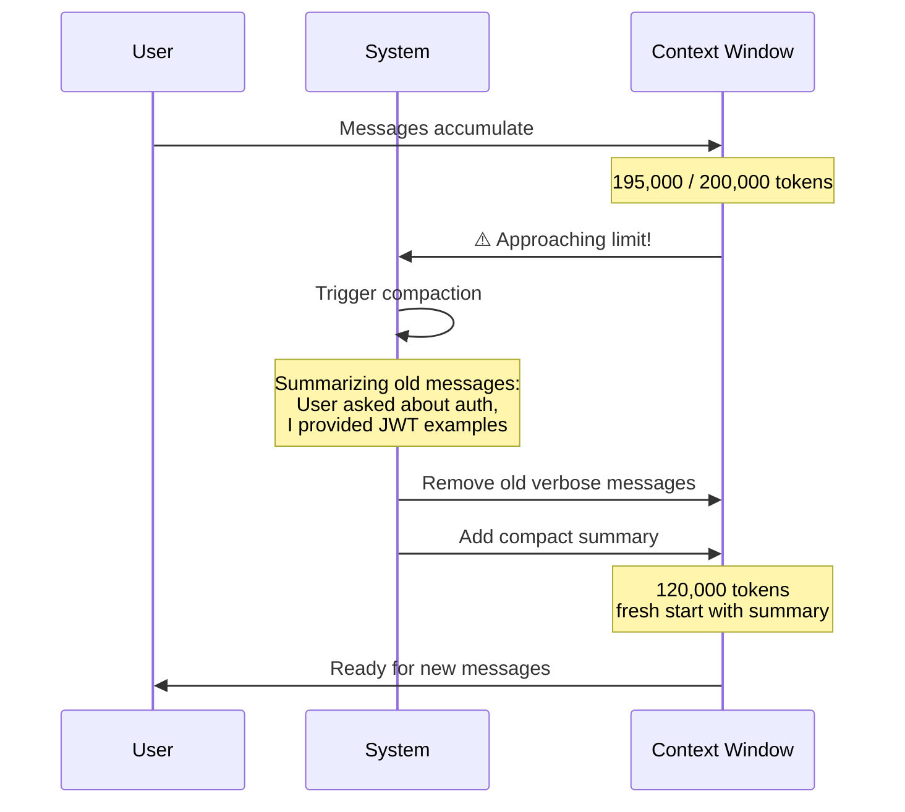
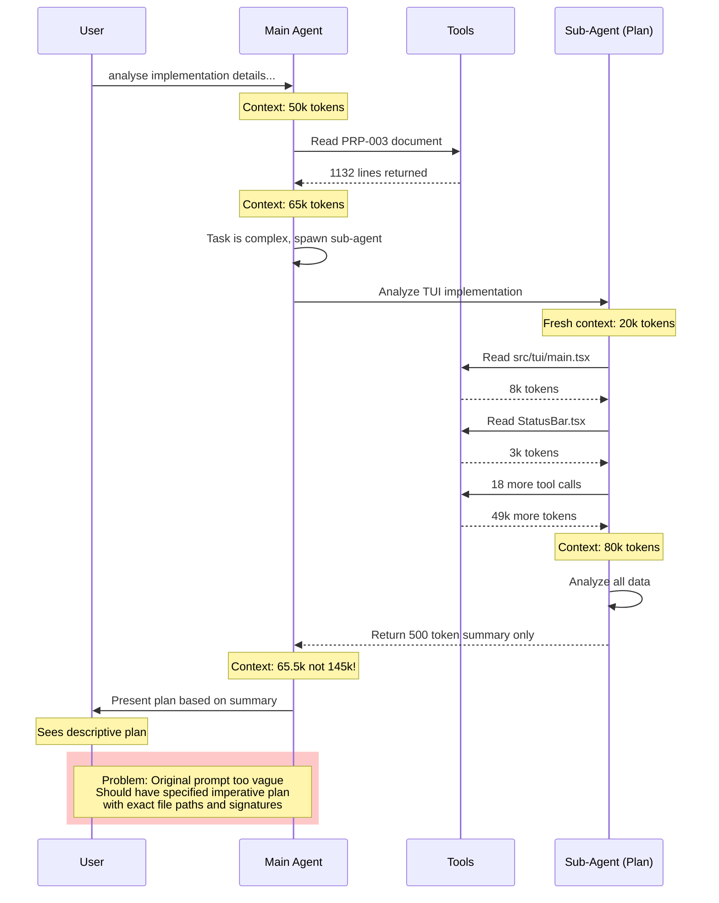
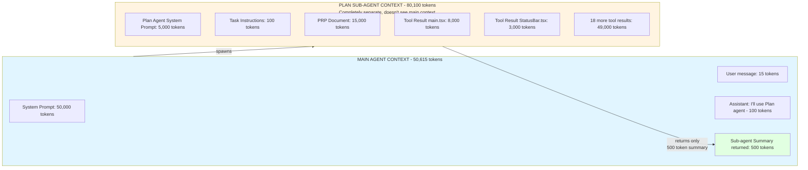
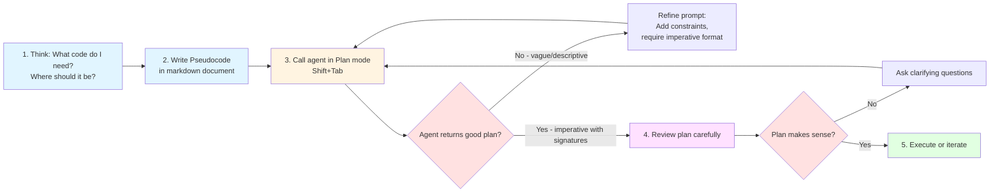
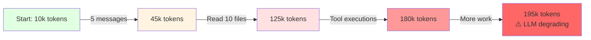
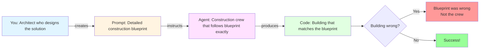

# Working with Large Language Models: A Practical Guide

## Table of Contents
1. [Architecture: From Client to Backend](#1-architecture-from-client-to-backend)
2. [LLM Limitations: Understanding Statistical Models](#2-llm-limitations-understanding-statistical-models)
3. [Claude Code Request-Response Flow](#3-claude-code-request-response-flow)
4. [Token Economics: Understanding the Costs](#4-token-economics-understanding-the-costs)
5. [Best Practices for Working with Claude Code](#5-best-practices-for-working-with-claude-code)
6. [Context Pollution Control](#6-context-pollution-control)
7. [Advanced: Token Optimization Strategies](#7-advanced-token-optimization-strategies)
8. [Troubleshooting Common Issues](#8-troubleshooting-common-issues)
9. [Conclusion: Working Effectively with LLMs](#9-conclusion-working-effectively-with-llms)
10. [Appendix: Quick Reference](#appendix-quick-reference)

---

## 1. Architecture: From Client to Backend

### How LLMs Process Your Requests

```mermaid
flowchart LR
    A["CLIENT: You"] -->|"Your Message: Analyze this code"| B["HTTP REQUEST"]
    
    B -->|"POST /v1/messages"| C["BACKEND PROCESSING"]
    
    C --> D["Step 1: CONTEXT ASSEMBLY"]
    D --> D1["System Prompt<br/>fixed instructions"]
    D --> D2["Your Message History<br/>conversation"]
    D --> D3["Hidden Summaries<br/>compaction"]
    D --> D4["Tool Results<br/>if agent used tools"]
    D1 --> D5["FULL CONTEXT<br/>what LLM sees"]
    D2 --> D5
    D3 --> D5
    D4 --> D5
    
    D5 --> E["Step 2: TOKENIZATION"]
    E --> E1["Text to tokens<br/>Context: 45,620 tokens<br/>Max: 200,000 tokens"]
    
    E1 --> F["Step 3: LLM INFERENCE"]
    F --> F1["Neural network<br/>processes tokens"]
    F1 --> F2["Predicts next token<br/>statistically"]
    F2 --> F3["Repeats until<br/>stopping condition"]
    
    F3 --> G{"Context<br/>approaching<br/>limit?"}
    G -->|Yes| H["Step 4: COMPACTION"]
    H --> H1["Automatic compaction"]
    H1 --> H2["Old messages summarized"]
    H2 --> H3["Summary added"]
    H3 --> H4["Verbose content removed"]
    G -->|No| I["HTTP RESPONSE"]
    H4 --> I
    
    I --> J["Response<br/>input: 1247 tokens<br/>output: 543 tokens"]
    J --> K["CLIENT: You"]
    K --> L["Sees: Here's my analysis..."]
    
    style A fill:#e1f5ff
    style K fill:#e1f5ff
    style C fill:#fff4e1
    style D fill:#f0f0f0
    style E fill:#f0f0f0
    style F fill:#f0f0f0
    style G fill:#ffe1e1
    style H fill:#ffe1e1
    style I fill:#e1ffe1
```



### What is a Prompt?

A **prompt** is your input message that instructs the LLM what to do. It can be:
- A simple question: "What is recursion?"
- A complex instruction: "Refactor this Python code to use async/await patterns"
- A multi-part request with examples and constraints

**Key principle**: Prompts should be specific, actionable, and include success criteria.

### What is Context? (Claude Code Perspective)

**Context** is everything the LLM "sees" when generating a response:

1. **System Prompt**: Core instructions about the LLM's role and capabilities (hidden from you, typically 30-70k tokens)
2. **Your Messages**: All messages you've sent in the conversation
3. **LLM Responses**: All previous responses from the LLM
4. **Hidden Summaries**: Compacted versions of old exchanges to save space
5. **Tool Results**: Output from tools the agent has used (file reads, bash commands, web searches)
6. **Memory/CLAUDE.md**: Project-specific instructions if configured

**CRITICAL**: Context is constantly polluted! Use `Ctrl+O` in Claude Code to see what's in your context.

### Context Overflow Management



**Technical details**:
- Compaction typically triggers at ~90-95% of context limit
- Summaries are generated by the same LLM
- Recent messages (last 5-10 exchanges) are never compacted
- Tool results may be removed but kept in a cache for potential re-retrieval

---

## 2. LLM Limitations: Understanding Statistical Models

### Core Limitations

LLMs are **statistical pattern matchers**, not reasoning entities. They:

1. **Cannot fantasize or imagine**: They have no real-world experience, only patterns from training data
2. **Rely on word co-occurrence statistics**: "What sequence of tokens is most likely to follow these tokens?"
3. **Have no internal fact-checker**: Truth is incidental to statistical likelihood
4. **Cannot prioritize context like humans**: They use architectural hacks instead:
   - **Position bias**: Earlier content in context window is weighted more heavily
   - **Formatting bias**: Text in **BOLD**, CAPS, or with special markers gets higher attention scores
   - **Recency bias**: Recent messages have more weight (except in very long contexts)
   - **Attention mechanism limitations**: Information can be "lost" in the middle of very long contexts

### Hallucinations Are Inevitable

Recent research ([Xu et al., 2024](https://arxiv.org/abs/2401.11817)) proves mathematically that hallucinations cannot be completely eliminated because:

- **Gödel's Incompleteness applies**: LLMs cannot learn all computable functions
- **Training data limitations**: Always incomplete, contains contradictions and errors
- **Statistical prediction ≠ factual truth**: Most likely next token ≠ correct answer
- **RLHF training**: Models trained to prefer confident answers over "I don't know" (penalized for uncertainty)
- **No halting problem solution**: LLMs cannot predict when they'll generate incorrect information

**From research** ([Huang et al., 2023](https://arxiv.org/abs/2311.05232)): 
- Hallucination rates vary from 1.5% to 83% depending on domain and model
- Medical/legal domains show higher hallucination rates due to specialized terminology
- Retrieval-Augmented Generation (RAG) reduces but doesn't eliminate hallucinations

### How Humans Should Delegate Tasks

**RULE**: LLMs need detailed instructions. What you don't write won't be done.

Think of the LLM like **Mister Meeseeks** from Rick and Morty: it will try to solve your task in the shortest, most literal way possible. It does **not** "fill in the gaps" with intuition.

**Mental model**: LLM = Function executor, not creative collaborator.

---

### Examples: Bad vs Good Prompts

#### ❌ BAD PROMPTS (Focus on what human knows, vague instructions)

```
BAD: "Analyse implementation prp/PRPs/PRP-003-tui-implementation.md"
```
**Why bad**: 
- No specific instructions on WHAT to analyze
- No guidance on OUTPUT format
- No context about what matters
- Relies on LLM to "figure out" what you want
- **Result**: Agent makes assumptions, returns descriptive analysis instead of actionable plan

```
BAD: "Fix the bug in my code"
```
**Why bad**:
- Which code? Which file?
- What bug? What's the expected behavior?
- No error messages or symptoms provided
- No constraints (don't break existing functionality)

```
BAD: "Make this better"
```
**Why bad**:
- "Better" is completely undefined
- No success criteria
- No constraints or preferences
- Could optimize for speed, readability, brevity, or correctness

---

#### ✅ GOOD PROMPTS (Contain explicit instructions, focus LLM)

```
GOOD: "Analyse implementation details in our code according to 
prp/PRPs/PRP-003-tui-implementation.md. 

Specifically:
1. Read the PRP document first to understand requirements
2. Compare each requirement against the current implementation in src/tui/
3. List what has been implemented, partially implemented, and not implemented
4. For each partially implemented feature, specify what's missing
5. Return results as a markdown table with columns: Requirement | Status | Details | Priority

Constraints:
- Do not make code changes, only analyze
- Focus on functional requirements, not code quality
- If requirements are ambiguous, list them as "Needs Clarification"
```
**Why good**:
- Explicit step-by-step instructions
- Clear output format specified (markdown table with specific columns)
- Specific files/paths mentioned
- Success criteria defined
- Constraints prevent scope creep

```
GOOD: "Fix the null pointer exception in src/auth/login.js line 47.

Error message: 'Cannot read property 'token' of undefined'
Error occurs when: User submits login form with valid credentials but API returns 500 error

Expected behavior: Show user-friendly error message, don't crash

Modify the code to:
1. Add null check before accessing user.token
2. Return error object: { success: false, error: 'Authentication service unavailable' }
3. Add unit test: test/auth/login.test.js covering this case
4. Update error handling documentation in docs/api/auth.md

Do not modify:
- The existing happy path (successful login flow)
- Database connection logic
- Session management code
```
**Why good**:
- Specific file and line number
- Exact error message and reproduction steps
- Expected behavior clearly described
- Concrete action items listed with file paths
- Explicit constraints on what NOT to change

---

### Declarative vs Imperative Instructions

**Imperative** (Do A, then B, then C):
```
1. Read the file src/utils/helpers.js
2. Find all TODO comments  
3. For each TODO, create a GitHub issue with label "todo"
4. Add the issue number as a comment next to the TODO
5. Commit changes with message "Link TODOs to issues"
```
Good for **starting out** and **simple tasks**. Very explicit, hard to misinterpret.

**Declarative** (Describe desired outcome):
```
"Transform all TODO comments in the codebase into GitHub issues with 
appropriate labels (frontend/backend/bug/feature) based on the file location 
and comment content. Link each TODO to its issue number. The commit message 
should describe the total number of issues created."
```
Better for **complex tasks** once you understand how agents work. Gives agent flexibility in implementation while constraining the outcome.

**Hybrid** (Best approach):
```
"Goal: All TODO comments tracked as GitHub issues

Steps:
1. Scan codebase for TODO/FIXME comments
2. Create issues with:
   - Title: First line of TODO comment
   - Body: Full comment + file location + code context
   - Labels: Auto-assign based on:
     * frontend/ → label:frontend
     * backend/ → label:backend
     * Contains 'bug' → label:bug
     * Otherwise → label:enhancement
3. Update comments: TODO → TODO(#123) where 123 is issue number
4. Commit with message: 'Track {count} TODOs as GitHub issues'

Constraints:
- Skip TODOs already linked to issues: TODO(#\d+)
- Don't create duplicate issues (check existing by title)
- Preserve original comment formatting
```
Combines imperative steps with declarative outcomes and explicit constraints.

---

## 3. Claude Code Request-Response Flow

### Visual Overview



### Real Example Breakdown

Let's trace through an actual Claude Code interaction:

#### **USER REQUEST**
```bash
> analyse implementation details in our code according to 
  prp/PRPs/PRP-003-tui-implementation.md
```

---

#### **Step 1: Initial Response + Hidden Command**

**What you see:**
```
⏺ I'll analyze the implementation details for PRP-003 TUI implementation. 
  Let me first read the PRP document and then examine the current codebase 
  to understand what has been implemented.
```

**What happens in context:**
- Agent decides it needs to read the file first
- Generates hidden tool call: `Read(PRPs/PRP-003-tui-implementation.md)`

**Context at this point:**
```
[System Prompt: ~50k tokens]
[User Message: "analyse implementation..." ~15 tokens]
[Assistant Thinking: "I need to read PRP first..." ~50 tokens]
[Tool Call: Read(...) - waiting for result]
Total: ~50,065 tokens
```

---

#### **Step 2: Tool Execution**

**What you see:**
```
⏺ Read(PRPs/PRP-003-tui-implementation.md)
  ⎿  Read 1132 lines
```

**What happens:**
- File content loaded into context (full 1132 lines)
- Context size increases significantly
- Claude now has the full requirements document

**Context now:**
```
[System Prompt: ~50k tokens]
[User Message: ~15 tokens]
[Assistant Thinking: ~50 tokens]
[Tool Result: File contents - ~15k tokens]
Total: ~65,065 tokens
```

**Why this matters**: Every tool result stays in context until:
1. You manually clear with `/clear`
2. Automatic compaction triggers near limit
3. Session ends

---

#### **Step 3: Agent Decides to Use Sub-Agent**

**What you see:**
```
⏺ Now I'll use the Task tool with a Plan subagent to analyze the TUI 
  implementation details comprehensively.
```

**What happens:**
- Main agent realizes task is complex (needs to read many files)
- Decides to spawn a **sub-agent with independent context**
- Sub-agent gets its own fresh context window (doesn't inherit main agent's 65k tokens)

**Why sub-agents?**
1. **Context isolation**: Sub-agent doesn't pollute main conversation
2. **Specialized instructions**: Sub-agent can have different system prompt (e.g., "You are a code analysis expert")
3. **Parallel work**: Multiple sub-agents can work simultaneously (not shown here)
4. **Cost efficiency**: Main agent doesn't pay token cost for sub-agent's exploration

---

#### **Step 4: Sub-Agent Execution**

**What you see:**
```
⏺ Plan(Analyze TUI implementation progress)
  ⎿  Done (20 tool uses · 80.1k tokens · 1m 4s)
```

**What happens in sub-agent context:**

**Sub-agent receives:**
```
[Sub-agent System Prompt: "You are a code analysis expert..." ~5k tokens]
[Task: "Analyze TUI implementation against PRP-003" ~100 tokens]
[PRP Document: ~15k tokens]
[Access to tools: Read, Bash, Search codebase]
Total start: ~20,100 tokens
```

**Sub-agent executes 20 tool calls:**
1. `Read(src/tui/main.tsx)` - loads main TUI file (~8k tokens)
2. `Read(src/tui/components/StatusBar.tsx)` - checks status bar (~3k tokens)
3. `Read(src/tui/components/PRPList.tsx)` - checks PRP list (~4k tokens)
4. `Bash(grep -r "EventBus" src/)` - searches for event integration (~2k tokens)
5. `Read(src/tui/hooks/useKeyboard.tsx)` - keyboard hooks (~3k tokens)
6-20. ... More file reads and searches (~30k tokens)

**Sub-agent context grows to 80,100 tokens** with all the code it read.

**Sub-agent performs analysis and generates SHORT SUMMARY:**
```json
{
  "status": "65% complete",
  "implemented": [
    "Basic TUI layout with StatusBar and PRPList components",
    "Static rendering of PRP information",
    "Component structure following requirements"
  ],
  "partially_implemented": [
    "Keyboard navigation (Tab works, S/X shortcuts missing)",
    "Debug mode (screen exists but no live data)"
  ],
  "missing_features": [
    "Real-time EventBus integration",
    "Melody.json file generation for music sync",
    "Complete keyboard navigation (S/X actions)",
    "Live agent status updates"
  ],
  "implementation_quality": "excellent",
  "critical_blockers": 2,
  "estimated_completion": "3-4 days"
}
```

**IMPORTANT**: Only this ~500 token summary (not full 80k context) returns to main agent!

**Token savings**:
- Without sub-agent: Main context would be 50k + 15 + 15k + 80k = **145,015 tokens**
- With sub-agent: Main context stays at 50k + 15 + 15k + 500 = **65,515 tokens**
- **Savings: 79,500 tokens (~55% reduction)**

---

#### **Step 5: Main Agent Response**

**What you see:**
```
⏺ Based on my comprehensive analysis of the TUI implementation 
  according to PRP-003, I can now present a detailed plan for 
  completing the remaining work.
```

**Main agent context:**
```
[System Prompt: ~50k tokens]
[User Message: ~15 tokens]
[PRP Document: ~15k tokens]
[Sub-agent Summary: ~500 tokens]  ← Only the summary, not 80k!
Total: ~65,515 tokens (manageable)
```

Main agent now synthesizes the summary into a user-facing response.

---

#### **Step 6: Bad Output - Plan Generated**

**What you see (in Claude Code TUI):**
```
────────────────────────────────────────────────────────────────────────
 Ready to code?

 Here is Claude's plan:
╌╌╌╌╌╌╌╌╌╌╌╌╌╌╌╌╌╌╌╌╌╌╌╌╌╌╌╌╌╌╌╌╌╌╌╌╌╌╌╌╌╌╌╌╌╌╌╌╌╌╌╌╌╌╌╌╌╌╌╌╌╌╌╌╌╌╌╌
 TUI Implementation Completion Plan

 Current Status Summary
 The TUI system is 65% production-ready with excellent code quality...

 Immediate Priority Actions (High Impact, Low Effort)

 1. Generate Melody.json File (1-2 hours)
 - Run existing melody generator tool at scripts/generate-melody.ts
 - Create classical composition bit encoding for idle melody blink system
 
 2. Connect Real-time EventBus Integration (2-3 days)
 - Bridge TUI components to live orchestrator/scanner/inspector events
 - Replace static mock data with real system state
╌╌╌╌╌╌╌╌╌╌╌╌╌╌╌╌╌╌╌╌╌╌╌╌╌╌╌╌╌╌╌╌╌╌╌╌╌╌╌╌╌╌╌╌╌╌╌╌╌╌╌╌╌╌╌╌╌╌╌╌╌╌╌╌╌╌╌╌

 Would you like to proceed?

 ❯ 1. Yes, and auto-accept edits
   2. Yes, and manually approve edits
   3. No, keep planning
```

---

#### **Why This Output is BAD**

**The original prompt was BAD:**
```
❌ "analyse implementation details in our code according to 
   prp/PRPs/PRP-003-tui-implementation.md"
```

**Why?** It asked to "analyse" but didn't specify:
- What format the analysis should take (table? list? report?)
- Whether to generate a plan or just report status
- Whether to make the plan imperative (with exact commands) or descriptive
- What level of detail needed (file paths? line numbers? function signatures?)

**The plan generated is DESCRIPTIVE (bad for execution):**
```
❌ DESCRIPTIVE (vague):
1. Generate Melody.json File (1-2 hours)
   - Run existing melody generator tool...
   - Create classical composition bit encoding...
```

**Why it's bad**:
- "Run existing melody generator tool" - which command exactly?
- "Create classical composition bit encoding" - what does this mean in code terms?
- No file paths, no function signatures, no concrete next steps

**Good imperative plan would be:**
```
✅ IMPERATIVE (actionable):
1. Generate Melody.json File
   File: scripts/generate-melody.ts
   Action: Execute `npm run generate-melody`
   Expected output: src/assets/melody.json
   File content structure:
   {
     "notes": Note[],  // Array of {pitch: number, duration: number, timestamp: number}
     "tempo": number,  // BPM
     "signature": [number, number]  // Time signature [4, 4]
   }
   Validation: Run `npm run validate-melody` to ensure format correct
   Integration point: src/tui/components/MusicSync.tsx line 47
   
2. Connect Real-time EventBus Integration
   Files to modify:
   - src/tui/hooks/useEventBus.ts (create new file)
   - src/tui/components/StatusBar.tsx (add line 23: import useEventBus)
   - src/tui/components/PRPList.tsx (add line 15: import useEventBus)
   
   Implementation:
   ```typescript
   // src/tui/hooks/useEventBus.ts
   import { useEffect, useState } from 'react';
   import { EventBus } from '@/core/EventBus';
   
   export function useEventBus<T>(eventName: string) {
     const [data, setData] = useState<T | null>(null);
     
     useEffect(() => {
       const handler = (payload: T) => setData(payload);
       EventBus.on(eventName, handler);
       return () => EventBus.off(eventName, handler);
     }, [eventName]);
     
     return data;
   }
   ```
   
   Usage in StatusBar.tsx line 23:
   ```typescript
   const agentStatus = useEventBus<AgentStatus>('agent:status:update');
   ```
```

**What was missing from the original prompt:**
```
"Before planning, require that the sub-agent:
1. Studies ALL existing files in the project to understand architecture
2. Returns IMPERATIVE instructions containing:
   - Exact file paths for all changes
   - Function signatures for new code
   - Specific method calls with parameters
   - Expected output/validation steps
   - Integration points (file + line number)
3. Asks clarifying questions if requirements are ambiguous
4. Provides code snippets for critical implementations

Output format: Numbered action items with sub-sections for:
- File: (path)
- Action: (command or edit)
- Code: (if applicable)
- Validation: (how to verify)
- Integration: (where it connects)"
```

---

### Sub-Agent Context Isolation



**Key Benefits:**
1. **Context efficiency**: Main context stays at 65k instead of 145k (55% savings)
2. **Quality isolation**: Sub-agent can read entire codebase without polluting main conversation
3. **Specialized expertise**: Sub-agent gets specialized system prompt ("You are a code analysis expert focused on...")
4. **Parallel execution**: Multiple sub-agents can work simultaneously on different subtasks
5. **Error containment**: If sub-agent fails or produces bad output, main agent can retry with different approach
6. **Cost control**: Can use cheaper models for sub-agents (e.g., Haiku for simple tasks)

---

## 4. Token Economics: Understanding the Costs

### Token Calculation Basics

**1 token ≈ 4 characters** (for English text, approximate)

This is based on the BPE (Byte Pair Encoding) tokenization used by most modern LLMs.

**Language differences (Claude's tokenizer):**
```
English:  ~4 characters = 1 token
          1000 characters ≈ 250 tokens
          
Russian:  ~2.5 characters = 1 token  
          1000 characters ≈ 400 tokens (60% more expensive!)
          
Chinese:  ~1.5 characters = 1 token
          1000 characters ≈ 650 tokens (160% more expensive!)
          
Code:     ~3.5 characters = 1 token (more efficient due to symbols)
          1000 characters ≈ 285 tokens
```

**Practical example:**
```
English text: "Hello world, this is a test of tokenization"
Characters: 47
Tokens: ~12 tokens

Same meaning in Russian: "Привет мир, это тест токенизации"
Characters: 35  
Tokens: ~14 tokens (17% more tokens despite fewer characters!)

Same meaning in Chinese: "你好世界，这是一个分词测试"
Characters: 13
Tokens: ~13 tokens (similar to English despite fewer characters)
```

### Token Math Reference

```
1 token ≈ 4 bytes (English)

1 KB = 1,024 bytes ≈ 256 tokens (English)
10 KB ≈ 2,560 tokens
100 KB ≈ 25,600 tokens
1 MB = 1,048,576 bytes ≈ 262,144 tokens  

For Russian text (~2.5 chars per token):
1 KB ≈ 410 tokens (60% more than English)

For English text (~4 chars per token):  
1 KB ≈ 256 tokens

For code (~3.5 chars per token):
1 KB ≈ 292 tokens (slightly more efficient)
```

### Context Window Sizes (December 2024)

```
Model                          Context Window       Input Cost         Output Cost
─────────────────────────────────────────────────────────────────────────────────
Claude Opus 4                  200,000 tokens       $15/1M tokens      $75/1M tokens
Claude Sonnet 4.5              200,000 tokens       $3/1M tokens       $15/1M tokens
Claude Haiku 4                 200,000 tokens       $0.80/1M tokens    $4/1M tokens
GPT-4 Turbo                    128,000 tokens       $10/1M tokens      $30/1M tokens
GPT-4o                         128,000 tokens       $2.50/1M tokens    $10/1M tokens
Gemini 1.5 Pro                 2,000,000 tokens     $1.25/1M tokens    $5/1M tokens
Gemini 1.5 Flash               1,000,000 tokens     $0.075/1M tokens   $0.30/1M tokens
```

**Notes**: 
- Prices as of December 2024, subject to change
- Many providers offer volume discounts
- Prompt caching can reduce input costs by 90% for repeated content
- Batch API processing offers 50% discounts (with 24h latency)

### Cost Calculation Examples

#### Example 1: Simple Q&A Session (Claude Sonnet 4.5)

```
Scenario: 10 back-and-forth exchanges

User inputs: 10 messages × 50 tokens each = 500 tokens
Claude responses: 10 messages × 150 tokens each = 1,500 tokens
System prompt: 50,000 tokens (included in every request)

Total input tokens per message: 50,000 + cumulative conversation
- Message 1: 50,000 + 50 = 50,050 input tokens
- Message 2: 50,000 + 50 + 150 + 50 = 50,250 input tokens
- Message 3: 50,000 + 400 + 50 = 50,450 input tokens
- ...
- Message 10: 50,000 + 1,650 + 50 = 51,700 input tokens

Total input tokens: 50,050 + 50,250 + ... ≈ 505,000 tokens
Total output tokens: 1,500 tokens

Cost = (505,000 × $3/1M) + (1,500 × $15/1M)
     = $1.515 + $0.0225
     = $1.54 for the 10-message conversation

With prompt caching (90% discount on system prompt):
Cached: 50,000 tokens × 0.9 = 45,000 tokens saved per message
Savings: 45,000 × 9 messages × $3/1M = $1.215
New cost: $1.54 - $1.215 = $0.325
```

#### Example 2: Code Analysis Session (Claude Code)

```
Scenario: Analyzing a codebase with sub-agents

Main agent:
- System prompt: 50,000 tokens
- User message: 100 tokens ("Analyze codebase for security issues")
- File read (security policy): 5,000 tokens
- Sub-agent summary: 1,000 tokens
- Response: 2,000 tokens

Sub-agent (executes separately):
- System prompt: 5,000 tokens
- Task: 100 tokens
- Reads 20 files: 100,000 tokens
- Generates summary: 1,000 tokens

Main agent costs:
Input: 50,000 + 100 + 5,000 + 1,000 = 56,100 tokens = $0.168
Output: 2,000 tokens = $0.030
Total main: $0.198

Sub-agent costs:
Input: 5,000 + 100 + 100,000 = 105,100 tokens = $0.315
Output: 1,000 tokens = $0.015
Total sub: $0.330

Grand total: $0.528 for comprehensive codebase security analysis

Without sub-agents (all in main context):
Input: 50,000 + 100 + 5,000 + 100,000 = 155,100 tokens = $0.465
Output: 2,000 tokens = $0.030
Total: $0.495

Note: Sub-agents cost slightly MORE ($0.033 extra) but provide:
- Better context management
- Ability to parallelize
- Cleaner conversation history
- More reliable results (less context pollution)
```

#### Example 3: Multi-language Documentation

```
Same documentation (5,000 words ≈ 6,500 characters):

English: 6,500 chars ÷ 4 chars/token ≈ 1,625 tokens
Input cost: 1,625 × $3/1M = $0.005
Output cost (generate 2,000 tokens): $0.030
Total: $0.035

Russian: 6,500 chars ÷ 2.5 chars/token ≈ 2,600 tokens  
Input cost: 2,600 × $3/1M = $0.008
Output cost (generate 3,200 tokens): $0.048
Total: $0.056 (60% more expensive!)

Chinese: 6,500 chars ÷ 1.5 chars/token ≈ 4,333 tokens
Input cost: 4,333 × $3/1M = $0.013
Output cost (generate 5,200 tokens): $0.078
Total: $0.091 (160% more expensive!)
```

### Why English is Cheaper

From the token mathematics:
```
Same semantic meaning (50 words):

English: "The quick brown fox jumps over the lazy dog repeatedly" = ~13 tokens
Russian: "Быстрая коричневая лиса многократно прыгает через ленивую собаку" = ~21 tokens
Chinese: "敏捷的棕色狐狸反复跳过懒狗" = ~14 tokens

For 1000 words of content:
English: ~750 tokens → $0.00225 input cost (Sonnet 4.5)
Russian: ~1200 tokens → $0.00360 input cost (60% more!)
Chinese: ~800 tokens → $0.00240 input cost (similar to English)
```

**CRITICAL**: Write prompts in English with words that have MINIMAL ambiguity.

**Optimization strategies**:
1. Use English for prompts even if output language is different
2. Prefer shorter, unambiguous words ("use" vs "utilize")
3. Avoid redundant phrasing ("in order to" → "to")
4. Use technical abbreviations when appropriate (API, DB, UI)

---

## 5. Best Practices for Working with Claude Code

### 1. Start with Terminal (Not Complex Tools)

**DO**: Begin with Claude Code CLI
```bash
# Install Claude Code
npm install -g @anthropic-ai/claude-code

# Start interactive session
claude

# Or headless mode for automation
claude -p "Fix linting errors in src/"
```

**DON'T**: Jump into MCP servers, complex integrations, or babyAGI patterns on day one.

**Reason**: Master the basics first. Learn context management before adding complexity. Most productivity gains come from good prompts, not complex tooling.

**Learning path**:
1. Week 1: Basic prompts, file editing, `/clear` command
2. Week 2: Plan mode (`Shift+Tab`), understanding tool calls
3. Week 3: Sub-agents, context optimization
4. Week 4+: MCP servers, custom tools, advanced patterns

---

### 2. Master Context Control

**Context is limited. Context directly reflects work quality.**

When context overflows, LLMs start hallucinating. The smaller the context, the more efficient the LLM works.

**Golden Rules**: 
1. Clear context after completing a task
2. If a task requires more than one context window, you've made a mistake in task breakdown
3. Use sub-agents for analysis that requires reading many files
4. Monitor context size with `Ctrl+O`

**How to manage context:**
```bash
/clear     # Nuclear option: clear everything, start fresh
/compact   # Summarize old messages, keep recent exchanges
Ctrl+O     # View current context size and breakdown

# In code:
# Check context before expensive operations
if context_tokens > 150000:
    # Use sub-agent or clear context
```

**Context breakdown example:**
```
Total: 145,230 tokens / 200,000 limit (73%)
├─ System prompt: 52,341 tokens (36%)
├─ Conversation: 15,892 tokens (11%)
│  ├─ User messages: 3,421 tokens
│  └─ Assistant messages: 12,471 tokens
├─ Tool results: 76,997 tokens (53%)
│  ├─ File reads: 52,341 tokens
│  ├─ Bash output: 18,234 tokens
│  └─ Web searches: 6,422 tokens
└─ Memory/CLAUDE.md: 0 tokens

⚠️ Recommendation: Clear tool results with /compact or use sub-agent
```

---

### 3. Agents Give More Control

**Agents vs Chat Interface:**
- **Agents (Claude Code)**: Have tools (read files, execute code, search web), can spawn sub-agents, persist state
- **Chat (Claude.ai)**: Just conversation, artifacts, no persistent file access

**Sub-agents enable:**
- **Context isolation**: Main conversation stays clean
- **Specialized system prompts** per task ("You are a security expert", "You are a documentation writer")
- **Parallel execution**: Multiple sub-agents can work simultaneously
- **Error recovery**: If sub-agent fails, main agent can retry with different approach
- **Cost optimization**: Use cheaper models (Haiku) for simple sub-agent tasks

**When to use sub-agents:**
```
Use sub-agent when task involves:
✅ Reading many files (>10)
✅ Complex analysis requiring multiple steps
✅ Exploring uncertain codebases (need to search and understand)
✅ Generating large intermediate outputs not needed in main conversation
✅ Parallel work (e.g., frontend + backend simultaneously)

Don't use sub-agent when:
❌ Simple file edit (< 3 files)
❌ Direct question with clear answer
❌ Task requires iterative human feedback
❌ Output needs to be discussed in main conversation
```

---

### 4. Avoid Advanced Topics Initially

**Skip for now:**
- MCP (Model Context Protocol) servers - adds complexity, debug overhead
- Complex tool integrations - focus on built-in tools first
- babyAGI / matryoshka / AutoGPT patterns - requires deep understanding
- Custom system prompts - use defaults until you understand behavior
- Prompt caching optimization - premature optimization

**Focus on:**
- Writing good prompts (80% of value)
- Managing context effectively (15% of value)
- Understanding when to use sub-agents (5% of value)
- Learning to think like an architect

**Why this order?** 
- Diminishing returns: Good prompts give 10x improvement, advanced patterns give 1.2x improvement
- Learning curve: Bad prompts with MCP = still bad results
- Debugging: Simpler stack = easier to understand what went wrong

---

### 5. Prompt Engineering Mindset

**Prompts are NOT imperative instructions like "do A, do B"** (though that's easiest to start with).

**Better approach**: Write prompts that declaratively describe outcomes, but with constraints.

**Choose English words with MINIMAL meanings:**

❌ Bad: "Fix the code" 
- fix = repair? modify? improve? optimize? refactor?
- which code? all of it? specific function?
- what's broken? how do I know when it's fixed?

✅ Good: "Refactor the authentication module to use JWT tokens instead of sessions"
- refactor = restructure code
- authentication module = specific scope
- JWT tokens = specific technology
- instead of sessions = what to replace

❌ Bad: "Make it better"
- better = faster? cleaner? shorter? more robust?
- no success criteria
- no constraints

✅ Good: "Optimize the database query to reduce execution time below 100ms by adding an index on the user_id column"
- optimize = improve performance
- database query = specific scope
- below 100ms = measurable success criterion
- adding an index = specific technique
- user_id column = specific location

**Ambiguous words to avoid:**
- fix, improve, enhance, optimize (without specifics)
- better, worse, good, bad (subjective)
- soon, quick, fast (no quantification)
- simple, easy, complex (relative)
- clean, neat, elegant (subjective)

**Precise words to use:**
- refactor, extract, inline, rename (specific code operations)
- reduce, increase, maintain (with metrics)
- add, remove, replace, modify (clear actions)
- validate, verify, test, check (with criteria)
- before, after, when, while (temporal)

---

### 6. You Are the Architect

**Your role:**
1. **Understand** what needs to be done (requirements analysis)
2. **Design** the code structure precisely in your mind (architecture)
3. **ONLY THEN** write instructions (prompts) for the agent (specification)

**The agent is NOT:**
- A conversation partner (use Claude.ai for that)
- An idea generator (it has no creativity)
- A brainstorming buddy (it has no opinions)
- A mentor (it can't teach, only execute)

**The agent IS:**
- A precise executor of instructions
- A tool that does exactly what you specify
- Something that requires YOU to think deeply
- A force multiplier for implementation, not design

**On your first attempts, you'll code slower.** This is correct. You're learning to not relax your brain muscle. You need to think MORE with agents, not less.

**The paradox**: 
- Bad developer + Agent = Worse code faster
- Good developer + Agent = Better code faster

**Why?** Agent amplifies your inputs. Garbage in, garbage out. Brilliance in, brilliance out (faster).

If you want an illusion of conversation, use ChatGPT web interface, not Claude Code.

---

### 7. The Workflow



**Before calling the agent:**

1. **Think**: What code do I need? Where should it be?

2. **Write pseudocode** in a markdown document:
```markdown
# Authentication Refactor Plan

## Goal
Replace session-based auth with JWT tokens

## Files to modify

### src/auth/login.ts
- Function: `handleLogin(username, password)`
  - Remove: `session.set('userId', user.id)`
  - Add: `const token = jwt.sign({userId: user.id}, SECRET, {expiresIn: '24h'})`
  - Return: `{success: true, token}`
  
### src/auth/middleware.ts
- Function: `authenticateRequest(req, res, next)`
  - Remove: `const userId = session.get('userId')`
  - Add: `const token = req.headers.authorization?.split(' ')[1]`
  - Add: `const decoded = jwt.verify(token, SECRET)`
  - Add: `req.userId = decoded.userId`

### src/auth/types.ts
- Add interface: `JWTPayload { userId: string, exp: number, iat: number }`

## New files to create

### src/auth/jwt.ts
- Export: `generateToken(userId: string): string`
- Export: `verifyToken(token: string): JWTPayload | null`
- Export: `refreshToken(oldToken: string): string | null`

## Dependencies
- Add: `npm install jsonwebtoken @types/jsonwebtoken`
- Environment variable: `JWT_SECRET` in .env

## Testing
- Test: Invalid token returns 401
- Test: Expired token returns 401  
- Test: Valid token allows access
- Test: Refresh token extends expiry

## Migration
- Generate tokens for existing sessions
- Maintain session support for 1 week (parallel)
- Remove session code after migration complete
```

3. **Call agent in Plan mode** (`Shift+Tab` in Claude Code):
```bash
> Implement JWT authentication according to the pseudocode in auth-plan.md.

Before planning, you must:
1. Read auth-plan.md for complete requirements
2. Read ALL existing files in src/auth/ to understand current implementation  
3. Check package.json to see if jwt library is already installed
4. Read .env.example to understand environment variable structure

Return a detailed imperative plan with:
- Exact function signatures for all new code
- Specific files and line numbers for modifications
- Code snippets for critical implementations (token generation, verification)
- Test cases with expected inputs/outputs
- Step-by-step migration plan with rollback strategy

If any requirements are ambiguous, ask specific questions before planning.

Output format:
## File: [path]
### Action: [create|modify|delete]
### Changes:
[Detailed changes with line numbers or code snippets]
### Validation:
[How to verify this change works]

Do not proceed to implementation yet, only create the plan.
```

4. **Review the plan** the agent returns
   - Check for completeness (all files mentioned?)
   - Check for correctness (logic makes sense?)
   - Check for safety (no data loss? rollback possible?)
   - Check for testability (can we verify it works?)

5. **Execute or refine** based on the plan quality
   - If plan is good: "Proceed with implementation"
   - If plan has gaps: "Before implementing, clarify: [specific questions]"
   - If plan is wrong: "This approach won't work because [reason]. Instead, [alternative approach]"

---

## 6. Context Pollution Control

### The Problem



**What happens at each stage:**

**10k tokens (healthy)**:
- Clean context, agent responds accurately
- Attention mechanism works well
- Fast inference (~2 seconds per response)

**45k tokens (still good)**:
- Some older messages starting to age out
- Still responsive and accurate
- Inference time ~3 seconds

**125k tokens (degrading)**:
- Attention mechanism struggling
- May miss details from early conversation
- Inference time ~5 seconds
- Increased hallucination risk (~2-5%)

**180k tokens (problematic)**:
- High risk of missing context
- Hallucination risk up to 10-15%
- Inference time ~8 seconds
- May confuse different parts of conversation

**195k tokens (critical)**:
- Automatic compaction likely triggered
- High hallucination risk (~20-30%)
- May generate incoherent responses
- Inference time ~10+ seconds
- **RECOMMENDED**: Clear context immediately

### The Solution

**Frequent clearing:**
```bash
Task: "Implement authentication"
→ Work on it (multiple prompts, file reads)
→ Task complete ✓
→ /clear immediately (critical!)

Next task: "Add logging"  
→ Fresh context, no pollution from auth work
→ Clean slate, optimal performance
```

**Task boundaries** where you should `/clear`:
- After completing a feature
- Before starting a new, unrelated task
- After reading many files (>15-20)
- After failed attempts (clear the garbage)
- After sub-agent returns (main agent doesn't need sub-agent's details)
- When context > 150k tokens
- When you notice quality degradation

**Use sub-agents for isolation:**
```bash
> Use code-analyzer sub-agent to find performance issues in src/,
  then use optimizer sub-agent to fix them.
  
# Sub-agents work in parallel, isolated contexts
# Main conversation stays clean
# Only summaries return to main context
```

**Each sub-agent gets fresh context, returns only summary to main agent.**

**Context hygiene checklist:**
```
Before long task:
☐ Check current context size (Ctrl+O)
☐ Clear if > 100k tokens
☐ Consider using sub-agent if task needs many file reads

During task:
☐ Monitor context growth
☐ Use /compact if approaching 150k
☐ Avoid re-reading same files

After task:
☐ /clear immediately
☐ Don't carry context to next task
☐ Start fresh
```

---

## 7. Advanced: Token Optimization Strategies

### 1. Prompt Compression

❌ Wasteful (127 tokens):
```
I would like you to please analyze the implementation details of our 
codebase specifically looking at the terminal user interface components 
and comparing them against the requirements document that I have which 
is located at the path prp/PRPs/PRP-003-tui-implementation.md and then 
provide me with a comprehensive breakdown of what has been completed 
versus what still needs to be done and also identify any potential 
issues or blockers that might prevent us from finishing this work.
```

✅ Efficient (31 tokens):
```
Analyze TUI implementation against prp/PRPs/PRP-003-tui-implementation.md.
Return: completion status, missing features, blockers.
Format: markdown table.
```

**Savings: 96 tokens (~76% reduction)**
**Cost savings per call**: 96 × $3/1M = $0.000288
**Over 1000 calls**: $0.288 saved

**Compression techniques:**
1. Remove filler words: "I would like you to please" → (nothing)
2. Remove redundancy: "what has been completed versus what still needs to be done" → "completion status"
3. Use imperatives: "provide me with a comprehensive breakdown" → "Return:"
4. Use abbreviations: "terminal user interface" → "TUI" (if established earlier)
5. Remove politeness: "please", "thank you" (not needed, agent doesn't care)

---

### 2. Avoid Repeated File Reads

❌ Bad (16k tokens wasted):
```
Message 1: "Analyze auth.ts"
→ Agent reads auth.ts (8k tokens added to context)

Message 2: "Now check if it handles errors properly"  
→ Agent reads auth.ts AGAIN (now 16k tokens total!)

Message 3: "What about the types?"
→ Agent reads auth.ts THIRD TIME (24k tokens!)
```

✅ Good (12k tokens total):
```
"Analyze auth.ts and auth-types.ts together. Check:
1. Logic correctness
2. Error handling completeness
3. Type safety
Return findings as numbered list."

→ Agent reads both files once (12k tokens)
→ All analysis done in single pass
→ 50% token savings
```

**Advanced: Batch requests**
```
"Review the entire auth module. For each file in src/auth/:
1. Check for security vulnerabilities
2. Verify error handling
3. Check type coverage
4. List any TODOs

Files: login.ts, middleware.ts, jwt.ts, types.ts, utils.ts

Return table: File | Security | Errors | Types | TODOs"

→ Agent reads all 5 files once
→ Performs all analyses in single context
→ Massive token savings vs 5 separate requests
```

---

### 3. Use Artifacts for Large Outputs

When asking for large code generation:
```
> Generate a complete REST API with CRUD operations for User, Post, Comment models.
  Include TypeScript types, validation, error handling, tests.

Claude creates artifact (separate context)
→ Your conversation context stays small (~1k tokens for request)
→ Artifact can be 50k+ tokens without polluting main context
→ Can regenerate artifact without affecting conversation
→ Can have multiple artifacts in same conversation
```

**When to use artifacts:**
- Generated code > 100 lines
- Documentation > 500 words
- Data analysis with large outputs
- Anything the user will copy/paste out

**When NOT to use artifacts:**
- Quick code snippets (< 50 lines)
- Iterative refinement (needs to be in main conversation)
- Error messages or logs (part of conversation flow)

---

### 4. Optimize Tool Calls

❌ Inefficient (25k tokens):
```
"Check if db.ts uses connection pooling"
→ Read db.ts (5k tokens)
→ Response: "Yes, it uses a pool"

"What's the pool size?"
→ Read db.ts again (5k tokens)
→ Response: "Pool size is 10"

"Is that enough for production?"
→ Read db.ts again (5k tokens)
→ Response: "Depends on load..."
```

✅ Efficient (5k tokens):
```
"Analyze db.ts connection pooling configuration.
Report:
1. Is pooling enabled?
2. Current pool size
3. Min/max connections
4. Timeout settings
5. Recommendation for production load (1000 concurrent users)

Return as structured list."

→ Read db.ts once (5k tokens)
→ All questions answered in one response
→ 80% token savings
```

---

### 5. Leverage Prompt Caching

**Prompt caching** (when available) can save 90% on repeated context:

```
First request:
System prompt (50k tokens): $0.15 (full price)
User message (100 tokens): $0.0003

Second request (within 5 minutes):
System prompt (50k tokens): $0.015 (90% discount, cached!)
User message (100 tokens): $0.0003

Savings per request: $0.135
Over 100 requests: $13.50 saved
```

**How to optimize for caching:**
1. Keep system prompt stable (don't change frequently)
2. Put variable content at END of prompt, not beginning
3. Group related tasks in same session (cache stays warm)
4. Use sub-agents with stable system prompts
5. Avoid unnecessary prompt variations

**Example: Bad for caching**
```
Message 1: "You are a Python expert. Analyze this code: [code A]"
Message 2: "You are a TypeScript expert. Analyze this code: [code B]"
Message 3: "You are a Python expert. Analyze this code: [code C]"
→ Cache misses on every request (different system prompts)
```

**Example: Good for caching**
```
System prompt: "You are a multi-language code expert."
Message 1: "Analyze this Python code: [code A]"
Message 2: "Analyze this TypeScript code: [code B]"  
Message 3: "Analyze this Python code: [code C]"
→ Cache hits on all requests (same system prompt)
```

---

## 8. Troubleshooting Common Issues

### Issue: "Claude keeps forgetting what we discussed"

**Symptoms:**
- Agent asks for information you already provided
- Agent repeats previous suggestions
- Agent doesn't remember earlier decisions

**Cause**: Context overflow - old messages compacted/removed

**Solutions**: 
1. Check context size with `Ctrl+O`
   - If > 150k tokens, use `/compact` or `/clear`
2. Use `/clear` more frequently (after each major task)
3. Break large tasks into smaller ones (each fits in one context)
4. Use sub-agents for isolated work (analysis, exploration)
5. Put critical information in CLAUDE.md file (always included)
6. Re-state critical constraints at start of each prompt

**Prevention:**
```bash
# Add to CLAUDE.md in project root:
## Critical Context (Always Remember)
- Authentication uses JWT tokens (not sessions)
- Database is PostgreSQL 14
- Use TypeScript strict mode
- All dates in ISO 8601 format
- Test coverage minimum: 80%
```

---

### Issue: "Agent is doing things I didn't ask for"

**Symptoms:**
- Agent modifies files you didn't mention
- Agent changes code style unexpectedly
- Agent adds features you didn't request

**Cause**: Vague prompt, agent filling in gaps with assumptions

**Solutions**: 
1. Be MORE specific in prompts
   - List exact files to modify
   - Specify what NOT to change
   - Define success criteria clearly

2. Use imperative instructions:
   ```
   ❌ "Improve the authentication code"
   ✅ "In src/auth/login.ts, add email validation before password check.
      Do not modify password hashing logic.
      Do not change error message formats."
   ```

3. Add explicit constraints:
   ```
   "Constraints:
   - Modify ONLY src/auth/login.ts
   - Do not change function signatures
   - Do not add new dependencies
   - Do not modify test files"
   ```

4. Use Plan mode to review before execution:
   ```bash
   Shift+Tab  # Enter plan mode
   # Review plan
   # If plan includes unexpected changes, refine prompt
   ```

---

### Issue: "Agent gives wrong/outdated information"

**Symptoms:**
- Agent suggests deprecated APIs
- Agent references non-existent libraries
- Agent provides incorrect factual information

**Cause**: Hallucination (statistical prediction, not facts)

**Solutions**:
1. Ask agent to search documentation:
   ```
   ❌ "How do I use the Anthropic API?"
   ✅ "Search the official Anthropic documentation for API authentication.
      Provide the current recommended approach."
   ```

2. Provide reference material in context:
   ```
   "Using the authentication approach described in docs/api/auth.md,
   implement JWT token validation."
   ```

3. Use RAG (Retrieval Augmented Generation) tools:
   - MCP servers for documentation
   - Vector databases for codebase search
   - Official docs as context

4. Verify critical information independently:
   - Check official docs manually
   - Test the generated code
   - Review diffs before committing

5. Request citations:
   ```
   "Explain JWT token expiration handling.
   Cite specific sections from RFC 7519 if possible."
   ```

---

### Issue: "Token costs are higher than expected"

**Symptoms:**
- Bills higher than estimated
- Individual requests expensive
- Context growing unexpectedly

**Causes**:
1. Context bloat (repeated file reads)
2. Using non-English text (2x tokens for Russian, 2.6x for Chinese)
3. Large outputs
4. Not using prompt caching
5. Wrong model selection (using Opus when Sonnet would suffice)

**Solutions**:
1. Clear context frequently:
   ```bash
   /clear     # After each major task
   Ctrl+O     # Monitor context size
   ```

2. Write prompts in English:
   ```
   ❌ Russian: 1000 chars = ~400 tokens = $0.0012 input (Sonnet)
   ✅ English: 1000 chars = ~250 tokens = $0.00075 input (Sonnet)
   Savings: 37.5% per request
   ```

3. Request concise outputs:
   ```
   "Summarize in <200 words"
   "Return only the function signature, not full implementation"
   "List the top 5 issues, not all 47"
   ```

4. Use sub-agents to isolate large analyses:
   ```
   "Use sub-agent to analyze all 50 files, return only:
   - Total lines of code
   - Average complexity score
   - Top 3 refactoring priorities"
   
   → Sub-agent reads 200k tokens
   → Main agent receives 100 token summary
   → 99.95% context savings
   ```

5. Choose right model:
   ```
   Simple tasks (linting, formatting): Haiku ($0.80/1M in)
   Code generation: Sonnet ($3/1M in)
   Complex architecture: Opus ($15/1M in)
   
   Example:
   Fix 100 linting errors:
   Haiku: $0.08
   Sonnet: $0.30 (4x more expensive!)
   Opus: $1.50 (19x more expensive!)
   ```

6. Enable prompt caching:
   - Use stable system prompts
   - Group related tasks
   - Cache saves 90% on repeated content

---

### Issue: "Agent is too slow"

**Symptoms:**
- Responses taking 30+ seconds
- Multiple retries before success
- Timeouts on large tasks

**Causes**:
1. Very large context (>150k tokens)
2. Complex tool chains (10+ tool calls)
3. Sub-agent spawning overhead
4. Large file reads (100k+ tokens)
5. Model choice (Opus slower than Sonnet)

**Solutions**:
1. Reduce context size:
   - `/clear` before starting
   - Remove large tool results
   - Use `/compact` instead of keeping full history

2. Optimize tool usage:
   - Batch file reads: "Read files A, B, C" (not separate requests)
   - Use grep/search instead of reading full files
   - Request specific functions, not entire files

3. Use faster model for simple tasks:
   ```
   Haiku: 2-3 seconds average
   Sonnet: 4-6 seconds average
   Opus: 8-12 seconds average
   ```

4. Parallelize with sub-agents:
   ```
   ❌ Serial (slow):
   Read file → Analyze → Fix → Test → Commit
   Total: 60 seconds
   
   ✅ Parallel (fast):
   Sub-agent 1: Analyze frontend files
   Sub-agent 2: Analyze backend files
   Sub-agent 3: Analyze database files
   Main agent: Merge results
   Total: 25 seconds
   ```

5. Use headless mode for batch processing:
   ```bash
   # Process 100 files
   ❌ Interactive: 100 × 10s = 1000s (17 minutes)
   ✅ Headless batch: 100 files in 300s (5 minutes)
   
   claude -p "Fix linting errors in src/**/*.ts" --dangerously-skip-permissions
   ```

---

## 9. Conclusion: Working Effectively with LLMs

### Key Takeaways

1. **LLMs are statistical tools**, not intelligent beings
   - They predict likely tokens, not truth
   - Hallucinations are mathematically inevitable
   - No real-world understanding or reasoning

2. **Context management is critical** for quality and cost
   - Clear context after each task
   - Monitor with `Ctrl+O`
   - Use sub-agents for exploration

3. **Specific prompts** yield better results than vague ones
   - Include: What, Why, How, Success criteria, Constraints
   - Avoid ambiguous words ("fix", "improve", "better")
   - Use imperative language for actions

4. **Sub-agents** enable complex workflows without context pollution
   - 55% context savings on average
   - Specialized system prompts
   - Parallel execution possible

5. **English text** is ~40-60% cheaper in tokens than Russian/Chinese
   - Write prompts in English
   - Use technical abbreviations
   - Avoid redundancy

6. **You must be the architect** - agents execute, they don't design
   - Think deeply before prompting
   - Design structure in your mind
   - Agent amplifies your quality (good or bad)

### The Mental Model



If the building is wrong, the blueprint was wrong. Not the crew.

### Success Metrics

Track your progress:
```
Week 1:
☐ Can write basic prompts that agent understands
☐ Can use /clear command
☐ Understand tool calls (Read, Bash)
☐ Task completion: 30 mins (vs 20 mins manual)

Week 2:
☐ Can use Plan mode (Shift+Tab)
☐ Can write prompts with constraints
☐ Understand context pollution
☐ Task completion: 15 mins (25% faster than manual)

Week 3:
☐ Can use sub-agents effectively
☐ Can optimize prompts for token efficiency
☐ Can debug when agent goes wrong
☐ Task completion: 10 mins (50% faster than manual)

Week 4:
☐ Can design complex workflows
☐ Can optimize costs (right model, caching)
☐ Can teach others
☐ Task completion: 5 mins (75% faster than manual)
```

### Next Steps

1. **Practice basic prompts** in Claude Code terminal
   - Start with simple file edits
   - Graduate to multi-file refactors
   - Focus on prompt clarity

2. **Master `/clear`** and context monitoring  
   - Use `Ctrl+O` habitually
   - Clear after each task
   - Develop "context hygiene"

3. **Experiment with Plan mode** (`Shift+Tab`)
   - Review plans before execution
   - Refine prompts based on plan quality
   - Learn what makes good imperatives

4. **Learn sub-agent patterns** for complex tasks
   - Start with simple analysis sub-agents
   - Progress to parallel sub-agents
   - Master context isolation

5. **Then explore**: MCP servers, advanced patterns, custom tools
   - Only after mastering basics
   - Add complexity incrementally
   - Measure impact on productivity

**Remember**: Going slow now means going fast later. Think deeply, prompt precisely, manage context actively.

---

## Appendix: Quick Reference

### Token Calculations
```
1 token ≈ 4 bytes (English)
English: 4 characters ≈ 1 token
Russian: 2.5 characters ≈ 1 token  
Chinese: 1.5 characters ≈ 1 token
Code: 3.5 characters ≈ 1 token

1 KB ≈ 256 tokens (English)
1 KB ≈ 410 tokens (Russian)
1 KB ≈ 680 tokens (Chinese)
1 MB ≈ 262,144 tokens (English)
```

### Context Limits (December 2024)
```
Claude Opus 4:         200,000 tokens
Claude Sonnet 4.5:     200,000 tokens  
Claude Haiku 4:        200,000 tokens
GPT-4 Turbo:           128,000 tokens
GPT-4o:                128,000 tokens
Gemini 1.5 Pro:        2,000,000 tokens
Gemini 1.5 Flash:      1,000,000 tokens
```

### Pricing (December 2024, per 1M tokens)
```
Model              Input      Output     Use Case
─────────────────────────────────────────────────────────────
Claude Opus 4      $15        $75        Complex reasoning
Claude Sonnet 4.5  $3         $15        Code generation (recommended)
Claude Haiku 4     $0.80      $4         Simple tasks, linting
GPT-4 Turbo        $10        $30        General use
GPT-4o             $2.50      $10        Fast general use
Gemini 1.5 Pro     $1.25      $5         Long context work
Gemini 1.5 Flash   $0.075     $0.30      Ultra-fast, cheap tasks
```

### Essential Commands
```bash
# Claude Code CLI
claude                      # Start interactive session
claude -p "prompt"          # Headless mode
claude --model sonnet-4     # Specify model
claude --dangerously-skip-permissions  # Auto-approve (use in containers only)

# In-session commands
/clear                      # Clear context completely
/compact                    # Compress old messages
/undo                       # Undo last change
/model                      # Switch models
/agents                     # Manage sub-agents
/settings                   # View configuration

# Keyboard shortcuts
Ctrl+O                      # View context stats
Ctrl+C                      # Interrupt agent
Escape (2x)                 # Rewind, edit previous prompt
Shift+Tab                   # Enter Plan mode
Ctrl+G                      # Edit plan in code
```

### Prompt Template
```markdown
[Action verb] [specific target] [according to/using] [reference].

Context:
- [Relevant background information]
- [Current state]

Requirements:
1. [Specific requirement with success criterion]
2. [Specific requirement with success criterion]
3. [Specific requirement with success criterion]

Output format: [markdown table / JSON / code / structured list]

Constraints:
- Do NOT modify [X]
- Do NOT add [Y]
- MUST use [specific technology/pattern]
- MUST complete in [time/complexity constraint]

Validation:
- [How to verify requirement 1]
- [How to verify requirement 2]
```

### Common Patterns

**File Analysis:**
```
"Analyze [file] for [specific issues].
Check: [criteria 1], [criteria 2], [criteria 3]
Return: Structured list with severity levels"
```

**Code Generation:**
```
"Create [component] in [file].
Must include: [feature 1], [feature 2]
Must NOT include: [anti-pattern]
Use existing patterns from [reference file]
Include: TypeScript types, error handling, tests"
```

**Refactoring:**
```
"Refactor [function/module] to [specific goal].
Current approach: [describe current]
Target approach: [describe target]
Do not modify: [external interfaces]
Maintain: [existing behavior]
Add: [new capability]"
```

**Bug Fix:**
```
"Fix [error type] in [file] line [X].
Error message: [exact error]
Reproduction: [steps]
Expected: [correct behavior]
Root cause: [if known]
Do not: [break existing tests]"
```

### Resources

**Official Documentation:**
- Claude API Docs: https://docs.anthropic.com
- Claude Code Docs: https://docs.anthropic.com/en/docs/claude-code/overview
- Prompt Engineering Guide: https://docs.anthropic.com/en/docs/build-with-claude/prompt-engineering/overview

**Research Papers:**
- [Hallucination is Inevitable (Xu et al., 2024)](https://arxiv.org/abs/2401.11817)
- [Survey on Hallucination in LLMs (Huang et al., 2023)](https://arxiv.org/abs/2311.05232)
- [Context Management (Anthropic Blog)](https://www.claude.com/blog/context-management)
- [Building Agents with Claude (Anthropic)](https://www.anthropic.com/engineering/building-agents-with-the-claude-agent-sdk)

**Community:**
- Discord: https://discord.gg/anthropic
- GitHub Discussions: https://github.com/anthropics/anthropic-sdk-typescript/discussions

**Tools:**
- Token Counter: https://token-calculator.net
- Claude Code VSCode Extension: https://marketplace.visualstudio.com/items?itemName=Anthropic.claude-code
